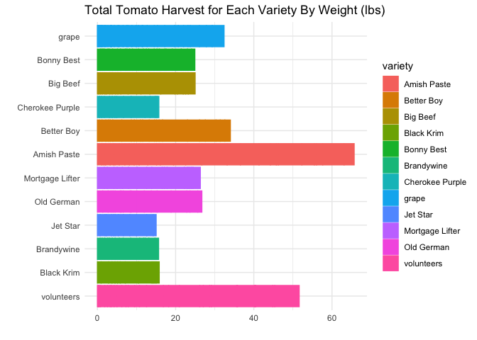
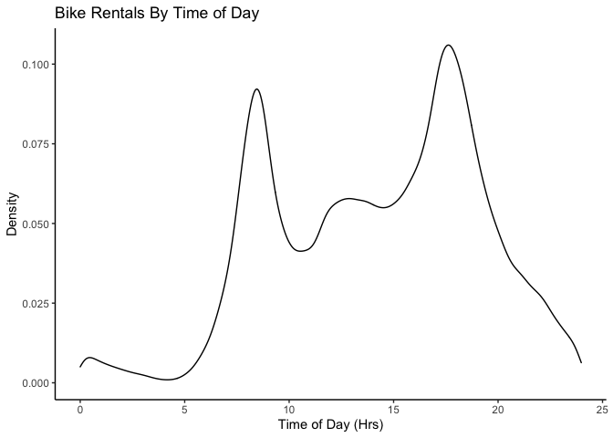
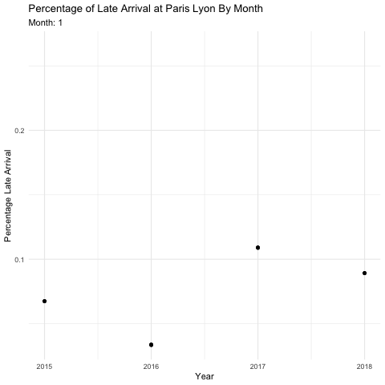
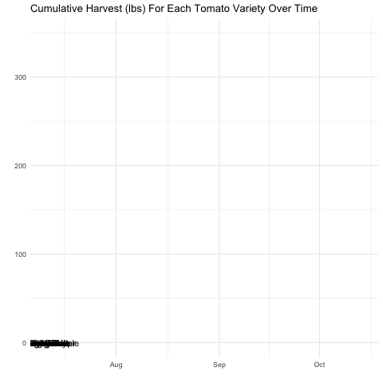
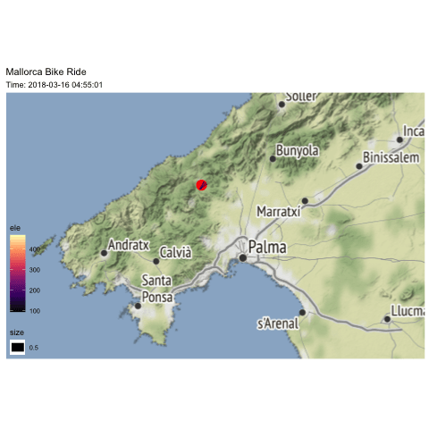
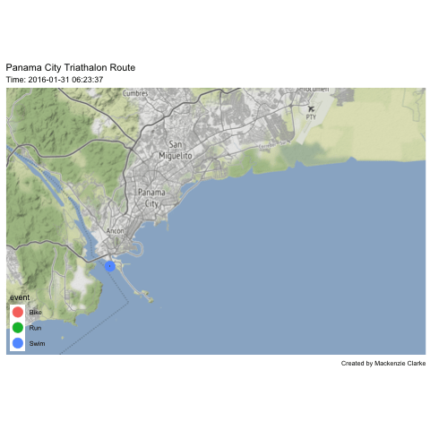
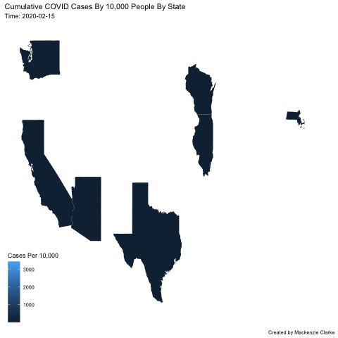

```r
library(tidyverse)     # for data cleaning and plotting
library(gardenR)       # for Lisa's garden data
library(lubridate)     # for date manipulation
library(openintro)     # for the abbr2state() function
library(palmerpenguins)# for Palmer penguin data
library(maps)          # for map data
library(ggmap)         # for mapping points on maps
library(gplots)        # for col2hex() function
library(RColorBrewer)  # for color palettes
library(sf)            # for working with spatial data
library(leaflet)       # for highly customizable mapping
library(ggthemes)      # for more themes (including theme_map())
library(plotly)        # for the ggplotly() - basic interactivity
library(gganimate)     # for adding animation layers to ggplots
library(transformr)    # for "tweening" (gganimate)
library(gifski)        # need the library for creating gifs but don't need to load each time
library(shiny)         # for creating interactive apps
theme_set(theme_minimal())
```


```r
# SNCF Train data
small_trains <- read_csv("https://raw.githubusercontent.com/rfordatascience/tidytuesday/master/data/2019/2019-02-26/small_trains.csv") 

# Lisa's garden data
data("garden_harvest")

# Lisa's Mallorca cycling data
mallorca_bike_day7 <- read_csv("https://www.dropbox.com/s/zc6jan4ltmjtvy0/mallorca_bike_day7.csv?dl=1") %>% 
  select(1:4, speed)

# Heather Lendway's Ironman 70.3 Pan Am championships Panama data
panama_swim <- read_csv("https://raw.githubusercontent.com/llendway/gps-data/master/data/panama_swim_20160131.csv")

panama_bike <- read_csv("https://raw.githubusercontent.com/llendway/gps-data/master/data/panama_bike_20160131.csv")

panama_run <- read_csv("https://raw.githubusercontent.com/llendway/gps-data/master/data/panama_run_20160131.csv")

#COVID-19 data from the New York Times
covid19 <- read_csv("https://raw.githubusercontent.com/nytimes/covid-19-data/master/us-states.csv")
```

## Put your homework on GitHub!

Go [here](https://github.com/llendway/github_for_collaboration/blob/master/github_for_collaboration.md) or to previous homework to remind yourself how to get set up. 

Once your repository is created, you should always open your **project** rather than just opening an .Rmd file. You can do that by either clicking on the .Rproj file in your repository folder on your computer. Or, by going to the upper right hand corner in R Studio and clicking the arrow next to where it says Project: (None). You should see your project come up in that list if you've used it recently. You could also go to File --> Open Project and navigate to your .Rproj file. 

## Instructions

* Put your name at the top of the document. 

* **For ALL graphs, you should include appropriate labels and alt text.** 

* Feel free to change the default theme, which I currently have set to `theme_minimal()`. 

* Use good coding practice. Read the short sections on good code with [pipes](https://style.tidyverse.org/pipes.html) and [ggplot2](https://style.tidyverse.org/ggplot2.html). **This is part of your grade!**

* **NEW!!** With animated graphs, add `eval=FALSE` to the code chunk that creates the animation and saves it using `anim_save()`. Add another code chunk to reread the gif back into the file. See the [tutorial](https://animation-and-interactivity-in-r.netlify.app/) for help. 

* When you are finished with ALL the exercises, uncomment the options at the top so your document looks nicer. Don't do it before then, or else you might miss some important warnings and messages.

## Warm-up exercises from tutorial

  1. Choose 2 graphs you have created for ANY assignment in this class and add interactivity using the `ggplotly()` function.


```r
tomato_harvest <- garden_harvest %>% 
  filter(vegetable %in% "tomatoes") %>% 
  group_by(variety) %>% 
  mutate(weight_lb = weight * 0.00220462) %>% 
  ungroup()

tomato_harvest_graph <- tomato_harvest %>% 
  ggplot(aes(x = weight_lb, 
             y = fct_reorder(variety, date, min, .desc = TRUE), 
             color = variety, 
             fill = variety)) +
  geom_col() +
  labs(x = "", 
       y = "", 
       title = "Total Tomato Harvest for Each Variety By Weight (lbs)") 

tomato_harvest_graph
```

<!-- -->

```r
ggplotly(tomato_harvest_graph)
```

```{=html}
<div id="htmlwidget-8bb65b56bb710f7892af" style="width:672px;height:480px;" class="plotly html-widget"></div>
<script type="application/json" data-for="htmlwidget-8bb65b56bb710f7892af">{"x":{"data":[{"orientation":"v","width":[1.02073906,0.46076558,0.43431014,0.21384814,1.12215158,0.84216484,0.3858085,1.11553772,1.41536604,1.1574255,1.2345872,1.29631656,2.19800614,2.2266662,0.943577360000001,3.39952404,3.086468,4.15791332,6.46835508,3.38850094,4.7619792,2.90348454,1.52559703999999,0.502653360000004,6.03624956,3.19008514,0.555564239999995,1.5763033,5.46304836,2.59042849999999],"base":[6.55,6.55,6.55,6.55,6.55,6.55,6.55,6.55,6.55,6.55,6.55,6.55,6.55,6.55,6.55,6.55,6.55,6.55,6.55,6.55,6.55,6.55,6.55,6.55,6.55,6.55,6.55,6.55,6.55,6.55],"x":[0.51036953,1.25112185,1.69865971,2.02273885,2.69073871,3.67289692,4.28688359,5.0375567,6.30300858,7.58940435,8.7854107,10.05086258,11.79802393,14.0103601,15.59548188,17.76703258,21.0100286,24.63221926,29.94535346,34.87378147,38.94902154,42.78175341,44.9962942,46.0104194,49.27987086,53.89303821,55.7658629,56.83179667,60.3514725,64.37821093],"y":[0.9,0.9,0.9,0.9,0.9,0.9,0.9,0.9,0.9,0.9,0.9,0.9,0.9,0.9,0.9,0.9,0.9,0.9,0.9,0.9,0.9,0.9,0.9,0.9,0.9,0.9,0.9,0.9,0.9,0.9],"text":["weight_lb: 1.02073906<br />fct_reorder(variety, date, min, .desc = TRUE): Amish Paste<br />variety: Amish Paste<br />variety: Amish Paste","weight_lb: 0.46076558<br />fct_reorder(variety, date, min, .desc = TRUE): Amish Paste<br />variety: Amish Paste<br />variety: Amish Paste","weight_lb: 0.43431014<br />fct_reorder(variety, date, min, .desc = TRUE): Amish Paste<br />variety: Amish Paste<br />variety: Amish Paste","weight_lb: 0.21384814<br />fct_reorder(variety, date, min, .desc = TRUE): Amish Paste<br />variety: Amish Paste<br />variety: Amish Paste","weight_lb: 1.12215158<br />fct_reorder(variety, date, min, .desc = TRUE): Amish Paste<br />variety: Amish Paste<br />variety: Amish Paste","weight_lb: 0.84216484<br />fct_reorder(variety, date, min, .desc = TRUE): Amish Paste<br />variety: Amish Paste<br />variety: Amish Paste","weight_lb: 0.38580850<br />fct_reorder(variety, date, min, .desc = TRUE): Amish Paste<br />variety: Amish Paste<br />variety: Amish Paste","weight_lb: 1.11553772<br />fct_reorder(variety, date, min, .desc = TRUE): Amish Paste<br />variety: Amish Paste<br />variety: Amish Paste","weight_lb: 1.41536604<br />fct_reorder(variety, date, min, .desc = TRUE): Amish Paste<br />variety: Amish Paste<br />variety: Amish Paste","weight_lb: 1.15742550<br />fct_reorder(variety, date, min, .desc = TRUE): Amish Paste<br />variety: Amish Paste<br />variety: Amish Paste","weight_lb: 1.23458720<br />fct_reorder(variety, date, min, .desc = TRUE): Amish Paste<br />variety: Amish Paste<br />variety: Amish Paste","weight_lb: 1.29631656<br />fct_reorder(variety, date, min, .desc = TRUE): Amish Paste<br />variety: Amish Paste<br />variety: Amish Paste","weight_lb: 2.19800614<br />fct_reorder(variety, date, min, .desc = TRUE): Amish Paste<br />variety: Amish Paste<br />variety: Amish Paste","weight_lb: 2.22666620<br />fct_reorder(variety, date, min, .desc = TRUE): Amish Paste<br />variety: Amish Paste<br />variety: Amish Paste","weight_lb: 0.94357736<br />fct_reorder(variety, date, min, .desc = TRUE): Amish Paste<br />variety: Amish Paste<br />variety: Amish Paste","weight_lb: 3.39952404<br />fct_reorder(variety, date, min, .desc = TRUE): Amish Paste<br />variety: Amish Paste<br />variety: Amish Paste","weight_lb: 3.08646800<br />fct_reorder(variety, date, min, .desc = TRUE): Amish Paste<br />variety: Amish Paste<br />variety: Amish Paste","weight_lb: 4.15791332<br />fct_reorder(variety, date, min, .desc = TRUE): Amish Paste<br />variety: Amish Paste<br />variety: Amish Paste","weight_lb: 6.46835508<br />fct_reorder(variety, date, min, .desc = TRUE): Amish Paste<br />variety: Amish Paste<br />variety: Amish Paste","weight_lb: 3.38850094<br />fct_reorder(variety, date, min, .desc = TRUE): Amish Paste<br />variety: Amish Paste<br />variety: Amish Paste","weight_lb: 4.76197920<br />fct_reorder(variety, date, min, .desc = TRUE): Amish Paste<br />variety: Amish Paste<br />variety: Amish Paste","weight_lb: 2.90348454<br />fct_reorder(variety, date, min, .desc = TRUE): Amish Paste<br />variety: Amish Paste<br />variety: Amish Paste","weight_lb: 1.52559704<br />fct_reorder(variety, date, min, .desc = TRUE): Amish Paste<br />variety: Amish Paste<br />variety: Amish Paste","weight_lb: 0.50265336<br />fct_reorder(variety, date, min, .desc = TRUE): Amish Paste<br />variety: Amish Paste<br />variety: Amish Paste","weight_lb: 6.03624956<br />fct_reorder(variety, date, min, .desc = TRUE): Amish Paste<br />variety: Amish Paste<br />variety: Amish Paste","weight_lb: 3.19008514<br />fct_reorder(variety, date, min, .desc = TRUE): Amish Paste<br />variety: Amish Paste<br />variety: Amish Paste","weight_lb: 0.55556424<br />fct_reorder(variety, date, min, .desc = TRUE): Amish Paste<br />variety: Amish Paste<br />variety: Amish Paste","weight_lb: 1.57630330<br />fct_reorder(variety, date, min, .desc = TRUE): Amish Paste<br />variety: Amish Paste<br />variety: Amish Paste","weight_lb: 5.46304836<br />fct_reorder(variety, date, min, .desc = TRUE): Amish Paste<br />variety: Amish Paste<br />variety: Amish Paste","weight_lb: 2.59042850<br />fct_reorder(variety, date, min, .desc = TRUE): Amish Paste<br />variety: Amish Paste<br />variety: Amish Paste"],"type":"bar","textposition":"none","marker":{"autocolorscale":false,"color":"rgba(248,118,109,1)","line":{"width":1.88976377952756,"color":"rgba(248,118,109,1)"}},"name":"Amish Paste","legendgroup":"Amish Paste","showlegend":true,"xaxis":"x","yaxis":"y","hoverinfo":"text","frame":null},{"orientation":"v","width":[0.4850164,0.68784144,0.97444204,0.6393398,0.46517482,0.67902296,2.3038279,2.42949124,0.78043548,1.60275874,0.52469956,1.68432968,1.3558413,0.507062600000001,0.68122758,0.866415659999999,6.39119338,3.06883104,1.4770954,2.73152418,1.08908228,1.15963012,1.42418452],"base":[7.55,7.55,7.55,7.55,7.55,7.55,7.55,7.55,7.55,7.55,7.55,7.55,7.55,7.55,7.55,7.55,7.55,7.55,7.55,7.55,7.55,7.55,7.55],"x":[0.2425082,0.82893712,1.66007886,2.46696978,3.01922709,3.59132598,5.08275141,7.44941098,9.05437434,10.24597145,11.3097006,12.41421522,13.93430071,14.86575266,15.45989775,16.23371937,19.86252389,24.5925361,26.86549932,28.96980911,30.88011234,32.00446854,33.29637586],"y":[0.899999999999999,0.899999999999999,0.899999999999999,0.899999999999999,0.899999999999999,0.899999999999999,0.899999999999999,0.899999999999999,0.899999999999999,0.899999999999999,0.899999999999999,0.899999999999999,0.899999999999999,0.899999999999999,0.899999999999999,0.899999999999999,0.899999999999999,0.899999999999999,0.899999999999999,0.899999999999999,0.899999999999999,0.899999999999999,0.899999999999999],"text":["weight_lb: 0.48501640<br />fct_reorder(variety, date, min, .desc = TRUE): Better Boy<br />variety: Better Boy<br />variety: Better Boy","weight_lb: 0.68784144<br />fct_reorder(variety, date, min, .desc = TRUE): Better Boy<br />variety: Better Boy<br />variety: Better Boy","weight_lb: 0.97444204<br />fct_reorder(variety, date, min, .desc = TRUE): Better Boy<br />variety: Better Boy<br />variety: Better Boy","weight_lb: 0.63933980<br />fct_reorder(variety, date, min, .desc = TRUE): Better Boy<br />variety: Better Boy<br />variety: Better Boy","weight_lb: 0.46517482<br />fct_reorder(variety, date, min, .desc = TRUE): Better Boy<br />variety: Better Boy<br />variety: Better Boy","weight_lb: 0.67902296<br />fct_reorder(variety, date, min, .desc = TRUE): Better Boy<br />variety: Better Boy<br />variety: Better Boy","weight_lb: 2.30382790<br />fct_reorder(variety, date, min, .desc = TRUE): Better Boy<br />variety: Better Boy<br />variety: Better Boy","weight_lb: 2.42949124<br />fct_reorder(variety, date, min, .desc = TRUE): Better Boy<br />variety: Better Boy<br />variety: Better Boy","weight_lb: 0.78043548<br />fct_reorder(variety, date, min, .desc = TRUE): Better Boy<br />variety: Better Boy<br />variety: Better Boy","weight_lb: 1.60275874<br />fct_reorder(variety, date, min, .desc = TRUE): Better Boy<br />variety: Better Boy<br />variety: Better Boy","weight_lb: 0.52469956<br />fct_reorder(variety, date, min, .desc = TRUE): Better Boy<br />variety: Better Boy<br />variety: Better Boy","weight_lb: 1.68432968<br />fct_reorder(variety, date, min, .desc = TRUE): Better Boy<br />variety: Better Boy<br />variety: Better Boy","weight_lb: 1.35584130<br />fct_reorder(variety, date, min, .desc = TRUE): Better Boy<br />variety: Better Boy<br />variety: Better Boy","weight_lb: 0.50706260<br />fct_reorder(variety, date, min, .desc = TRUE): Better Boy<br />variety: Better Boy<br />variety: Better Boy","weight_lb: 0.68122758<br />fct_reorder(variety, date, min, .desc = TRUE): Better Boy<br />variety: Better Boy<br />variety: Better Boy","weight_lb: 0.86641566<br />fct_reorder(variety, date, min, .desc = TRUE): Better Boy<br />variety: Better Boy<br />variety: Better Boy","weight_lb: 6.39119338<br />fct_reorder(variety, date, min, .desc = TRUE): Better Boy<br />variety: Better Boy<br />variety: Better Boy","weight_lb: 3.06883104<br />fct_reorder(variety, date, min, .desc = TRUE): Better Boy<br />variety: Better Boy<br />variety: Better Boy","weight_lb: 1.47709540<br />fct_reorder(variety, date, min, .desc = TRUE): Better Boy<br />variety: Better Boy<br />variety: Better Boy","weight_lb: 2.73152418<br />fct_reorder(variety, date, min, .desc = TRUE): Better Boy<br />variety: Better Boy<br />variety: Better Boy","weight_lb: 1.08908228<br />fct_reorder(variety, date, min, .desc = TRUE): Better Boy<br />variety: Better Boy<br />variety: Better Boy","weight_lb: 1.15963012<br />fct_reorder(variety, date, min, .desc = TRUE): Better Boy<br />variety: Better Boy<br />variety: Better Boy","weight_lb: 1.42418452<br />fct_reorder(variety, date, min, .desc = TRUE): Better Boy<br />variety: Better Boy<br />variety: Better Boy"],"type":"bar","textposition":"none","marker":{"autocolorscale":false,"color":"rgba(222,140,0,1)","line":{"width":1.88976377952756,"color":"rgba(222,140,0,1)"}},"name":"Better Boy","legendgroup":"Better Boy","showlegend":true,"xaxis":"x","yaxis":"y","hoverinfo":"text","frame":null},{"orientation":"v","width":[0.30203294,0.44753786,0.49163026,0.67681834,0.35714844,0.91050806,0.58642892,0.87523414,0.58201968,0.75838928,1.85629004,2.18918766,1.09569614,2.27737246,2.7888443,3.63541838,0.670204479999999,1.45284458,0.599656639999999,0.696659919999998,1.74385442],"base":[9.55,9.55,9.55,9.55,9.55,9.55,9.55,9.55,9.55,9.55,9.55,9.55,9.55,9.55,9.55,9.55,9.55,9.55,9.55,9.55,9.55],"x":[0.15101647,0.52580187,0.99538593,1.57961023,2.09659362,2.73042187,3.47889036,4.20972189,4.9383488,5.60855328,6.91589294,8.93863179,10.58107369,12.26760799,14.80071637,18.01284771,20.16565914,21.22718367,22.25343428,22.90159256,24.12184973],"y":[0.899999999999999,0.899999999999999,0.899999999999999,0.899999999999999,0.899999999999999,0.899999999999999,0.899999999999999,0.899999999999999,0.899999999999999,0.899999999999999,0.899999999999999,0.899999999999999,0.899999999999999,0.899999999999999,0.899999999999999,0.899999999999999,0.899999999999999,0.899999999999999,0.899999999999999,0.899999999999999,0.899999999999999],"text":["weight_lb: 0.30203294<br />fct_reorder(variety, date, min, .desc = TRUE): Big Beef<br />variety: Big Beef<br />variety: Big Beef","weight_lb: 0.44753786<br />fct_reorder(variety, date, min, .desc = TRUE): Big Beef<br />variety: Big Beef<br />variety: Big Beef","weight_lb: 0.49163026<br />fct_reorder(variety, date, min, .desc = TRUE): Big Beef<br />variety: Big Beef<br />variety: Big Beef","weight_lb: 0.67681834<br />fct_reorder(variety, date, min, .desc = TRUE): Big Beef<br />variety: Big Beef<br />variety: Big Beef","weight_lb: 0.35714844<br />fct_reorder(variety, date, min, .desc = TRUE): Big Beef<br />variety: Big Beef<br />variety: Big Beef","weight_lb: 0.91050806<br />fct_reorder(variety, date, min, .desc = TRUE): Big Beef<br />variety: Big Beef<br />variety: Big Beef","weight_lb: 0.58642892<br />fct_reorder(variety, date, min, .desc = TRUE): Big Beef<br />variety: Big Beef<br />variety: Big Beef","weight_lb: 0.87523414<br />fct_reorder(variety, date, min, .desc = TRUE): Big Beef<br />variety: Big Beef<br />variety: Big Beef","weight_lb: 0.58201968<br />fct_reorder(variety, date, min, .desc = TRUE): Big Beef<br />variety: Big Beef<br />variety: Big Beef","weight_lb: 0.75838928<br />fct_reorder(variety, date, min, .desc = TRUE): Big Beef<br />variety: Big Beef<br />variety: Big Beef","weight_lb: 1.85629004<br />fct_reorder(variety, date, min, .desc = TRUE): Big Beef<br />variety: Big Beef<br />variety: Big Beef","weight_lb: 2.18918766<br />fct_reorder(variety, date, min, .desc = TRUE): Big Beef<br />variety: Big Beef<br />variety: Big Beef","weight_lb: 1.09569614<br />fct_reorder(variety, date, min, .desc = TRUE): Big Beef<br />variety: Big Beef<br />variety: Big Beef","weight_lb: 2.27737246<br />fct_reorder(variety, date, min, .desc = TRUE): Big Beef<br />variety: Big Beef<br />variety: Big Beef","weight_lb: 2.78884430<br />fct_reorder(variety, date, min, .desc = TRUE): Big Beef<br />variety: Big Beef<br />variety: Big Beef","weight_lb: 3.63541838<br />fct_reorder(variety, date, min, .desc = TRUE): Big Beef<br />variety: Big Beef<br />variety: Big Beef","weight_lb: 0.67020448<br />fct_reorder(variety, date, min, .desc = TRUE): Big Beef<br />variety: Big Beef<br />variety: Big Beef","weight_lb: 1.45284458<br />fct_reorder(variety, date, min, .desc = TRUE): Big Beef<br />variety: Big Beef<br />variety: Big Beef","weight_lb: 0.59965664<br />fct_reorder(variety, date, min, .desc = TRUE): Big Beef<br />variety: Big Beef<br />variety: Big Beef","weight_lb: 0.69665992<br />fct_reorder(variety, date, min, .desc = TRUE): Big Beef<br />variety: Big Beef<br />variety: Big Beef","weight_lb: 1.74385442<br />fct_reorder(variety, date, min, .desc = TRUE): Big Beef<br />variety: Big Beef<br />variety: Big Beef"],"type":"bar","textposition":"none","marker":{"autocolorscale":false,"color":"rgba(183,159,0,1)","line":{"width":1.88976377952756,"color":"rgba(183,159,0,1)"}},"name":"Big Beef","legendgroup":"Big Beef","showlegend":true,"xaxis":"x","yaxis":"y","hoverinfo":"text","frame":null},{"orientation":"v","width":[0.96121432,1.88935934,0.86641566,0.79145858,0.64154442,0.69886454,1.27647498,3.39070556,3.46786726,0.476197920000001,0.520290319999999,0.8267325],"base":[1.55,1.55,1.55,1.55,1.55,1.55,1.55,1.55,1.55,1.55,1.55,1.55],"x":[0.48060716,1.90589399,3.28378149,4.11271861,4.82922011,5.49942459,6.48709435,8.82068462,12.24997103,14.22200362,14.72024774,15.39375915],"y":[0.9,0.9,0.9,0.9,0.9,0.9,0.9,0.9,0.9,0.9,0.9,0.9],"text":["weight_lb: 0.96121432<br />fct_reorder(variety, date, min, .desc = TRUE): Black Krim<br />variety: Black Krim<br />variety: Black Krim","weight_lb: 1.88935934<br />fct_reorder(variety, date, min, .desc = TRUE): Black Krim<br />variety: Black Krim<br />variety: Black Krim","weight_lb: 0.86641566<br />fct_reorder(variety, date, min, .desc = TRUE): Black Krim<br />variety: Black Krim<br />variety: Black Krim","weight_lb: 0.79145858<br />fct_reorder(variety, date, min, .desc = TRUE): Black Krim<br />variety: Black Krim<br />variety: Black Krim","weight_lb: 0.64154442<br />fct_reorder(variety, date, min, .desc = TRUE): Black Krim<br />variety: Black Krim<br />variety: Black Krim","weight_lb: 0.69886454<br />fct_reorder(variety, date, min, .desc = TRUE): Black Krim<br />variety: Black Krim<br />variety: Black Krim","weight_lb: 1.27647498<br />fct_reorder(variety, date, min, .desc = TRUE): Black Krim<br />variety: Black Krim<br />variety: Black Krim","weight_lb: 3.39070556<br />fct_reorder(variety, date, min, .desc = TRUE): Black Krim<br />variety: Black Krim<br />variety: Black Krim","weight_lb: 3.46786726<br />fct_reorder(variety, date, min, .desc = TRUE): Black Krim<br />variety: Black Krim<br />variety: Black Krim","weight_lb: 0.47619792<br />fct_reorder(variety, date, min, .desc = TRUE): Black Krim<br />variety: Black Krim<br />variety: Black Krim","weight_lb: 0.52029032<br />fct_reorder(variety, date, min, .desc = TRUE): Black Krim<br />variety: Black Krim<br />variety: Black Krim","weight_lb: 0.82673250<br />fct_reorder(variety, date, min, .desc = TRUE): Black Krim<br />variety: Black Krim<br />variety: Black Krim"],"type":"bar","textposition":"none","marker":{"autocolorscale":false,"color":"rgba(124,174,0,1)","line":{"width":1.88976377952756,"color":"rgba(124,174,0,1)"}},"name":"Black Krim","legendgroup":"Black Krim","showlegend":true,"xaxis":"x","yaxis":"y","hoverinfo":"text","frame":null},{"orientation":"v","width":[0.74736618,0.3086468,0.32628376,0.33730686,0.9590097,0.34392072,0.85318794,1.24120106,0.79145858,1.24340568,0.39462698,0.67681834,0.73193384,1.56748482,1.19710866,0.80248168,0.59745202,1.39331984,0.727524600000001,0.593042779999999,1.38670598,0.341716100000003,1.5652802,2.31926024,1.57409868,1.05160374,0.850983320000001],"base":[10.55,10.55,10.55,10.55,10.55,10.55,10.55,10.55,10.55,10.55,10.55,10.55,10.55,10.55,10.55,10.55,10.55,10.55,10.55,10.55,10.55,10.55,10.55,10.55,10.55,10.55,10.55],"x":[0.37368309,0.90168958,1.21915486,1.55095017,2.19910845,2.85057366,3.44912799,4.49632249,5.51265231,6.53008444,7.34910077,7.88482343,8.58919952,9.73890885,11.12120559,12.12100076,12.82096761,13.81635354,14.87677576,15.53705945,16.52693383,17.39114487,18.34464302,20.28691324,22.2335927,23.54644391,24.49773744],"y":[0.899999999999999,0.899999999999999,0.899999999999999,0.899999999999999,0.899999999999999,0.899999999999999,0.899999999999999,0.899999999999999,0.899999999999999,0.899999999999999,0.899999999999999,0.899999999999999,0.899999999999999,0.899999999999999,0.899999999999999,0.899999999999999,0.899999999999999,0.899999999999999,0.899999999999999,0.899999999999999,0.899999999999999,0.899999999999999,0.899999999999999,0.899999999999999,0.899999999999999,0.899999999999999,0.899999999999999],"text":["weight_lb: 0.74736618<br />fct_reorder(variety, date, min, .desc = TRUE): Bonny Best<br />variety: Bonny Best<br />variety: Bonny Best","weight_lb: 0.30864680<br />fct_reorder(variety, date, min, .desc = TRUE): Bonny Best<br />variety: Bonny Best<br />variety: Bonny Best","weight_lb: 0.32628376<br />fct_reorder(variety, date, min, .desc = TRUE): Bonny Best<br />variety: Bonny Best<br />variety: Bonny Best","weight_lb: 0.33730686<br />fct_reorder(variety, date, min, .desc = TRUE): Bonny Best<br />variety: Bonny Best<br />variety: Bonny Best","weight_lb: 0.95900970<br />fct_reorder(variety, date, min, .desc = TRUE): Bonny Best<br />variety: Bonny Best<br />variety: Bonny Best","weight_lb: 0.34392072<br />fct_reorder(variety, date, min, .desc = TRUE): Bonny Best<br />variety: Bonny Best<br />variety: Bonny Best","weight_lb: 0.85318794<br />fct_reorder(variety, date, min, .desc = TRUE): Bonny Best<br />variety: Bonny Best<br />variety: Bonny Best","weight_lb: 1.24120106<br />fct_reorder(variety, date, min, .desc = TRUE): Bonny Best<br />variety: Bonny Best<br />variety: Bonny Best","weight_lb: 0.79145858<br />fct_reorder(variety, date, min, .desc = TRUE): Bonny Best<br />variety: Bonny Best<br />variety: Bonny Best","weight_lb: 1.24340568<br />fct_reorder(variety, date, min, .desc = TRUE): Bonny Best<br />variety: Bonny Best<br />variety: Bonny Best","weight_lb: 0.39462698<br />fct_reorder(variety, date, min, .desc = TRUE): Bonny Best<br />variety: Bonny Best<br />variety: Bonny Best","weight_lb: 0.67681834<br />fct_reorder(variety, date, min, .desc = TRUE): Bonny Best<br />variety: Bonny Best<br />variety: Bonny Best","weight_lb: 0.73193384<br />fct_reorder(variety, date, min, .desc = TRUE): Bonny Best<br />variety: Bonny Best<br />variety: Bonny Best","weight_lb: 1.56748482<br />fct_reorder(variety, date, min, .desc = TRUE): Bonny Best<br />variety: Bonny Best<br />variety: Bonny Best","weight_lb: 1.19710866<br />fct_reorder(variety, date, min, .desc = TRUE): Bonny Best<br />variety: Bonny Best<br />variety: Bonny Best","weight_lb: 0.80248168<br />fct_reorder(variety, date, min, .desc = TRUE): Bonny Best<br />variety: Bonny Best<br />variety: Bonny Best","weight_lb: 0.59745202<br />fct_reorder(variety, date, min, .desc = TRUE): Bonny Best<br />variety: Bonny Best<br />variety: Bonny Best","weight_lb: 1.39331984<br />fct_reorder(variety, date, min, .desc = TRUE): Bonny Best<br />variety: Bonny Best<br />variety: Bonny Best","weight_lb: 0.72752460<br />fct_reorder(variety, date, min, .desc = TRUE): Bonny Best<br />variety: Bonny Best<br />variety: Bonny Best","weight_lb: 0.59304278<br />fct_reorder(variety, date, min, .desc = TRUE): Bonny Best<br />variety: Bonny Best<br />variety: Bonny Best","weight_lb: 1.38670598<br />fct_reorder(variety, date, min, .desc = TRUE): Bonny Best<br />variety: Bonny Best<br />variety: Bonny Best","weight_lb: 0.34171610<br />fct_reorder(variety, date, min, .desc = TRUE): Bonny Best<br />variety: Bonny Best<br />variety: Bonny Best","weight_lb: 1.56528020<br />fct_reorder(variety, date, min, .desc = TRUE): Bonny Best<br />variety: Bonny Best<br />variety: Bonny Best","weight_lb: 2.31926024<br />fct_reorder(variety, date, min, .desc = TRUE): Bonny Best<br />variety: Bonny Best<br />variety: Bonny Best","weight_lb: 1.57409868<br />fct_reorder(variety, date, min, .desc = TRUE): Bonny Best<br />variety: Bonny Best<br />variety: Bonny Best","weight_lb: 1.05160374<br />fct_reorder(variety, date, min, .desc = TRUE): Bonny Best<br />variety: Bonny Best<br />variety: Bonny Best","weight_lb: 0.85098332<br />fct_reorder(variety, date, min, .desc = TRUE): Bonny Best<br />variety: Bonny Best<br />variety: Bonny Best"],"type":"bar","textposition":"none","marker":{"autocolorscale":false,"color":"rgba(0,186,56,1)","line":{"width":1.88976377952756,"color":"rgba(0,186,56,1)"}},"name":"Bonny Best","legendgroup":"Bonny Best","showlegend":true,"xaxis":"x","yaxis":"y","hoverinfo":"text","frame":null},{"orientation":"v","width":[0.7054784,0.50926722,0.6393398,0.78484472,0.48060716,0.6724091,0.7385477,1.06483146,0.98326052,1.92022402,2.29721404,1.0141252,0.392422359999999,0.9479866,1.57409868,0.921531159999999],"base":[2.55,2.55,2.55,2.55,2.55,2.55,2.55,2.55,2.55,2.55,2.55,2.55,2.55,2.55,2.55,2.55],"x":[0.3527392,0.96011201,1.53441552,2.24650778,2.87923372,3.45574185,4.16122025,5.06290983,6.08695582,7.53869809,9.64741712,11.30308674,12.00636052,12.676565,13.93760764,15.18542256],"y":[0.9,0.9,0.9,0.9,0.9,0.9,0.9,0.9,0.9,0.9,0.9,0.9,0.9,0.9,0.9,0.9],"text":["weight_lb: 0.70547840<br />fct_reorder(variety, date, min, .desc = TRUE): Brandywine<br />variety: Brandywine<br />variety: Brandywine","weight_lb: 0.50926722<br />fct_reorder(variety, date, min, .desc = TRUE): Brandywine<br />variety: Brandywine<br />variety: Brandywine","weight_lb: 0.63933980<br />fct_reorder(variety, date, min, .desc = TRUE): Brandywine<br />variety: Brandywine<br />variety: Brandywine","weight_lb: 0.78484472<br />fct_reorder(variety, date, min, .desc = TRUE): Brandywine<br />variety: Brandywine<br />variety: Brandywine","weight_lb: 0.48060716<br />fct_reorder(variety, date, min, .desc = TRUE): Brandywine<br />variety: Brandywine<br />variety: Brandywine","weight_lb: 0.67240910<br />fct_reorder(variety, date, min, .desc = TRUE): Brandywine<br />variety: Brandywine<br />variety: Brandywine","weight_lb: 0.73854770<br />fct_reorder(variety, date, min, .desc = TRUE): Brandywine<br />variety: Brandywine<br />variety: Brandywine","weight_lb: 1.06483146<br />fct_reorder(variety, date, min, .desc = TRUE): Brandywine<br />variety: Brandywine<br />variety: Brandywine","weight_lb: 0.98326052<br />fct_reorder(variety, date, min, .desc = TRUE): Brandywine<br />variety: Brandywine<br />variety: Brandywine","weight_lb: 1.92022402<br />fct_reorder(variety, date, min, .desc = TRUE): Brandywine<br />variety: Brandywine<br />variety: Brandywine","weight_lb: 2.29721404<br />fct_reorder(variety, date, min, .desc = TRUE): Brandywine<br />variety: Brandywine<br />variety: Brandywine","weight_lb: 1.01412520<br />fct_reorder(variety, date, min, .desc = TRUE): Brandywine<br />variety: Brandywine<br />variety: Brandywine","weight_lb: 0.39242236<br />fct_reorder(variety, date, min, .desc = TRUE): Brandywine<br />variety: Brandywine<br />variety: Brandywine","weight_lb: 0.94798660<br />fct_reorder(variety, date, min, .desc = TRUE): Brandywine<br />variety: Brandywine<br />variety: Brandywine","weight_lb: 1.57409868<br />fct_reorder(variety, date, min, .desc = TRUE): Brandywine<br />variety: Brandywine<br />variety: Brandywine","weight_lb: 0.92153116<br />fct_reorder(variety, date, min, .desc = TRUE): Brandywine<br />variety: Brandywine<br />variety: Brandywine"],"type":"bar","textposition":"none","marker":{"autocolorscale":false,"color":"rgba(0,192,139,1)","line":{"width":1.88976377952756,"color":"rgba(0,192,139,1)"}},"name":"Brandywine","legendgroup":"Brandywine","showlegend":true,"xaxis":"x","yaxis":"y","hoverinfo":"text","frame":null},{"orientation":"v","width":[0.54454114,0.5291088,0.67681834,1.36465978,0.66799986,0.67902296,0.47619792,1.76810524,1.92242864,3.52959662,1.30733966,1.32056738,0.44312862,0.48281178],"base":[8.55,8.55,8.55,8.55,8.55,8.55,8.55,8.55,8.55,8.55,8.55,8.55,8.55,8.55],"x":[0.27227057,0.80909554,1.41205911,2.43279817,3.44912799,4.1226394,4.70024984,5.82240142,7.66766836,10.39368099,12.81214913,14.12610265,15.00795065,15.47092085],"y":[0.899999999999999,0.899999999999999,0.899999999999999,0.899999999999999,0.899999999999999,0.899999999999999,0.899999999999999,0.899999999999999,0.899999999999999,0.899999999999999,0.899999999999999,0.899999999999999,0.899999999999999,0.899999999999999],"text":["weight_lb: 0.54454114<br />fct_reorder(variety, date, min, .desc = TRUE): Cherokee Purple<br />variety: Cherokee Purple<br />variety: Cherokee Purple","weight_lb: 0.52910880<br />fct_reorder(variety, date, min, .desc = TRUE): Cherokee Purple<br />variety: Cherokee Purple<br />variety: Cherokee Purple","weight_lb: 0.67681834<br />fct_reorder(variety, date, min, .desc = TRUE): Cherokee Purple<br />variety: Cherokee Purple<br />variety: Cherokee Purple","weight_lb: 1.36465978<br />fct_reorder(variety, date, min, .desc = TRUE): Cherokee Purple<br />variety: Cherokee Purple<br />variety: Cherokee Purple","weight_lb: 0.66799986<br />fct_reorder(variety, date, min, .desc = TRUE): Cherokee Purple<br />variety: Cherokee Purple<br />variety: Cherokee Purple","weight_lb: 0.67902296<br />fct_reorder(variety, date, min, .desc = TRUE): Cherokee Purple<br />variety: Cherokee Purple<br />variety: Cherokee Purple","weight_lb: 0.47619792<br />fct_reorder(variety, date, min, .desc = TRUE): Cherokee Purple<br />variety: Cherokee Purple<br />variety: Cherokee Purple","weight_lb: 1.76810524<br />fct_reorder(variety, date, min, .desc = TRUE): Cherokee Purple<br />variety: Cherokee Purple<br />variety: Cherokee Purple","weight_lb: 1.92242864<br />fct_reorder(variety, date, min, .desc = TRUE): Cherokee Purple<br />variety: Cherokee Purple<br />variety: Cherokee Purple","weight_lb: 3.52959662<br />fct_reorder(variety, date, min, .desc = TRUE): Cherokee Purple<br />variety: Cherokee Purple<br />variety: Cherokee Purple","weight_lb: 1.30733966<br />fct_reorder(variety, date, min, .desc = TRUE): Cherokee Purple<br />variety: Cherokee Purple<br />variety: Cherokee Purple","weight_lb: 1.32056738<br />fct_reorder(variety, date, min, .desc = TRUE): Cherokee Purple<br />variety: Cherokee Purple<br />variety: Cherokee Purple","weight_lb: 0.44312862<br />fct_reorder(variety, date, min, .desc = TRUE): Cherokee Purple<br />variety: Cherokee Purple<br />variety: Cherokee Purple","weight_lb: 0.48281178<br />fct_reorder(variety, date, min, .desc = TRUE): Cherokee Purple<br />variety: Cherokee Purple<br />variety: Cherokee Purple"],"type":"bar","textposition":"none","marker":{"autocolorscale":false,"color":"rgba(0,191,196,1)","line":{"width":1.88976377952756,"color":"rgba(0,191,196,1)"}},"name":"Cherokee Purple","legendgroup":"Cherokee Purple","showlegend":true,"xaxis":"x","yaxis":"y","hoverinfo":"text","frame":null},{"orientation":"v","width":[0.05291088,0.18959732,0.06834322,0.23368972,0.28880522,0.0881848,0.20062042,0.220462,0.37037616,0.22487124,0.26014516,0.47840254,0.64374904,0.17857422,0.14109568,0.66579524,0.928145020000001,0.277782119999999,1.05160374,0.96121432,0.29982832,0.994283619999999,1.08687766,0.584224300000001,0.96121432,0.1653465,1.11553772,1.80558378,0.837755599999999,1.83644846,2.49342522,0.97444204,1.3558413,1.12215158,0.568791959999999,2.33248796,1.80558378,1.49473236,3.03576174],"base":[11.55,11.55,11.55,11.55,11.55,11.55,11.55,11.55,11.55,11.55,11.55,11.55,11.55,11.55,11.55,11.55,11.55,11.55,11.55,11.55,11.55,11.55,11.55,11.55,11.55,11.55,11.55,11.55,11.55,11.55,11.55,11.55,11.55,11.55,11.55,11.55,11.55,11.55,11.55],"x":[0.02645544,0.14770954,0.27667981,0.42769628,0.68894375,0.87743876,1.02184137,1.23238258,1.52780166,1.82542536,2.06793356,2.43720741,2.9982832,3.40944483,3.56927978,3.97272524,4.76969537,5.37265894,6.03735187,7.0437609,7.67428222,8.32133819,9.36191883,10.19746981,10.97018912,11.53346953,12.17391164,13.63447239,14.95614208,16.29324411,18.45818095,20.19211458,21.35725625,22.59625269,23.44172446,24.89236442,26.96140029,28.61155836,30.87680541],"y":[0.899999999999999,0.899999999999999,0.899999999999999,0.899999999999999,0.899999999999999,0.899999999999999,0.899999999999999,0.899999999999999,0.899999999999999,0.899999999999999,0.899999999999999,0.899999999999999,0.899999999999999,0.899999999999999,0.899999999999999,0.899999999999999,0.899999999999999,0.899999999999999,0.899999999999999,0.899999999999999,0.899999999999999,0.899999999999999,0.899999999999999,0.899999999999999,0.899999999999999,0.899999999999999,0.899999999999999,0.899999999999999,0.899999999999999,0.899999999999999,0.899999999999999,0.899999999999999,0.899999999999999,0.899999999999999,0.899999999999999,0.899999999999999,0.899999999999999,0.899999999999999,0.899999999999999],"text":["weight_lb: 0.05291088<br />fct_reorder(variety, date, min, .desc = TRUE): grape<br />variety: grape<br />variety: grape","weight_lb: 0.18959732<br />fct_reorder(variety, date, min, .desc = TRUE): grape<br />variety: grape<br />variety: grape","weight_lb: 0.06834322<br />fct_reorder(variety, date, min, .desc = TRUE): grape<br />variety: grape<br />variety: grape","weight_lb: 0.23368972<br />fct_reorder(variety, date, min, .desc = TRUE): grape<br />variety: grape<br />variety: grape","weight_lb: 0.28880522<br />fct_reorder(variety, date, min, .desc = TRUE): grape<br />variety: grape<br />variety: grape","weight_lb: 0.08818480<br />fct_reorder(variety, date, min, .desc = TRUE): grape<br />variety: grape<br />variety: grape","weight_lb: 0.20062042<br />fct_reorder(variety, date, min, .desc = TRUE): grape<br />variety: grape<br />variety: grape","weight_lb: 0.22046200<br />fct_reorder(variety, date, min, .desc = TRUE): grape<br />variety: grape<br />variety: grape","weight_lb: 0.37037616<br />fct_reorder(variety, date, min, .desc = TRUE): grape<br />variety: grape<br />variety: grape","weight_lb: 0.22487124<br />fct_reorder(variety, date, min, .desc = TRUE): grape<br />variety: grape<br />variety: grape","weight_lb: 0.26014516<br />fct_reorder(variety, date, min, .desc = TRUE): grape<br />variety: grape<br />variety: grape","weight_lb: 0.47840254<br />fct_reorder(variety, date, min, .desc = TRUE): grape<br />variety: grape<br />variety: grape","weight_lb: 0.64374904<br />fct_reorder(variety, date, min, .desc = TRUE): grape<br />variety: grape<br />variety: grape","weight_lb: 0.17857422<br />fct_reorder(variety, date, min, .desc = TRUE): grape<br />variety: grape<br />variety: grape","weight_lb: 0.14109568<br />fct_reorder(variety, date, min, .desc = TRUE): grape<br />variety: grape<br />variety: grape","weight_lb: 0.66579524<br />fct_reorder(variety, date, min, .desc = TRUE): grape<br />variety: grape<br />variety: grape","weight_lb: 0.92814502<br />fct_reorder(variety, date, min, .desc = TRUE): grape<br />variety: grape<br />variety: grape","weight_lb: 0.27778212<br />fct_reorder(variety, date, min, .desc = TRUE): grape<br />variety: grape<br />variety: grape","weight_lb: 1.05160374<br />fct_reorder(variety, date, min, .desc = TRUE): grape<br />variety: grape<br />variety: grape","weight_lb: 0.96121432<br />fct_reorder(variety, date, min, .desc = TRUE): grape<br />variety: grape<br />variety: grape","weight_lb: 0.29982832<br />fct_reorder(variety, date, min, .desc = TRUE): grape<br />variety: grape<br />variety: grape","weight_lb: 0.99428362<br />fct_reorder(variety, date, min, .desc = TRUE): grape<br />variety: grape<br />variety: grape","weight_lb: 1.08687766<br />fct_reorder(variety, date, min, .desc = TRUE): grape<br />variety: grape<br />variety: grape","weight_lb: 0.58422430<br />fct_reorder(variety, date, min, .desc = TRUE): grape<br />variety: grape<br />variety: grape","weight_lb: 0.96121432<br />fct_reorder(variety, date, min, .desc = TRUE): grape<br />variety: grape<br />variety: grape","weight_lb: 0.16534650<br />fct_reorder(variety, date, min, .desc = TRUE): grape<br />variety: grape<br />variety: grape","weight_lb: 1.11553772<br />fct_reorder(variety, date, min, .desc = TRUE): grape<br />variety: grape<br />variety: grape","weight_lb: 1.80558378<br />fct_reorder(variety, date, min, .desc = TRUE): grape<br />variety: grape<br />variety: grape","weight_lb: 0.83775560<br />fct_reorder(variety, date, min, .desc = TRUE): grape<br />variety: grape<br />variety: grape","weight_lb: 1.83644846<br />fct_reorder(variety, date, min, .desc = TRUE): grape<br />variety: grape<br />variety: grape","weight_lb: 2.49342522<br />fct_reorder(variety, date, min, .desc = TRUE): grape<br />variety: grape<br />variety: grape","weight_lb: 0.97444204<br />fct_reorder(variety, date, min, .desc = TRUE): grape<br />variety: grape<br />variety: grape","weight_lb: 1.35584130<br />fct_reorder(variety, date, min, .desc = TRUE): grape<br />variety: grape<br />variety: grape","weight_lb: 1.12215158<br />fct_reorder(variety, date, min, .desc = TRUE): grape<br />variety: grape<br />variety: grape","weight_lb: 0.56879196<br />fct_reorder(variety, date, min, .desc = TRUE): grape<br />variety: grape<br />variety: grape","weight_lb: 2.33248796<br />fct_reorder(variety, date, min, .desc = TRUE): grape<br />variety: grape<br />variety: grape","weight_lb: 1.80558378<br />fct_reorder(variety, date, min, .desc = TRUE): grape<br />variety: grape<br />variety: grape","weight_lb: 1.49473236<br />fct_reorder(variety, date, min, .desc = TRUE): grape<br />variety: grape<br />variety: grape","weight_lb: 3.03576174<br />fct_reorder(variety, date, min, .desc = TRUE): grape<br />variety: grape<br />variety: grape"],"type":"bar","textposition":"none","marker":{"autocolorscale":false,"color":"rgba(0,180,240,1)","line":{"width":1.88976377952756,"color":"rgba(0,180,240,1)"}},"name":"grape","legendgroup":"grape","showlegend":true,"xaxis":"x","yaxis":"y","hoverinfo":"text","frame":null},{"orientation":"v","width":[0.6944553,1.23899644,0.40565008,1.30293042,0.53131342,0.39903622,0.7936632,1.27427036,1.65787424,1.70417126,2.59704236,1.66228348,0.76279852],"base":[3.55,3.55,3.55,3.55,3.55,3.55,3.55,3.55,3.55,3.55,3.55,3.55,3.55],"x":[0.34722765,1.31395352,2.13627678,2.99056703,3.90768895,4.37286377,4.96921348,6.00318026,7.46925256,9.15027531,11.30088212,13.43054504,14.64308604],"y":[0.9,0.9,0.9,0.9,0.9,0.9,0.9,0.9,0.9,0.9,0.9,0.9,0.9],"text":["weight_lb: 0.69445530<br />fct_reorder(variety, date, min, .desc = TRUE): Jet Star<br />variety: Jet Star<br />variety: Jet Star","weight_lb: 1.23899644<br />fct_reorder(variety, date, min, .desc = TRUE): Jet Star<br />variety: Jet Star<br />variety: Jet Star","weight_lb: 0.40565008<br />fct_reorder(variety, date, min, .desc = TRUE): Jet Star<br />variety: Jet Star<br />variety: Jet Star","weight_lb: 1.30293042<br />fct_reorder(variety, date, min, .desc = TRUE): Jet Star<br />variety: Jet Star<br />variety: Jet Star","weight_lb: 0.53131342<br />fct_reorder(variety, date, min, .desc = TRUE): Jet Star<br />variety: Jet Star<br />variety: Jet Star","weight_lb: 0.39903622<br />fct_reorder(variety, date, min, .desc = TRUE): Jet Star<br />variety: Jet Star<br />variety: Jet Star","weight_lb: 0.79366320<br />fct_reorder(variety, date, min, .desc = TRUE): Jet Star<br />variety: Jet Star<br />variety: Jet Star","weight_lb: 1.27427036<br />fct_reorder(variety, date, min, .desc = TRUE): Jet Star<br />variety: Jet Star<br />variety: Jet Star","weight_lb: 1.65787424<br />fct_reorder(variety, date, min, .desc = TRUE): Jet Star<br />variety: Jet Star<br />variety: Jet Star","weight_lb: 1.70417126<br />fct_reorder(variety, date, min, .desc = TRUE): Jet Star<br />variety: Jet Star<br />variety: Jet Star","weight_lb: 2.59704236<br />fct_reorder(variety, date, min, .desc = TRUE): Jet Star<br />variety: Jet Star<br />variety: Jet Star","weight_lb: 1.66228348<br />fct_reorder(variety, date, min, .desc = TRUE): Jet Star<br />variety: Jet Star<br />variety: Jet Star","weight_lb: 0.76279852<br />fct_reorder(variety, date, min, .desc = TRUE): Jet Star<br />variety: Jet Star<br />variety: Jet Star"],"type":"bar","textposition":"none","marker":{"autocolorscale":false,"color":"rgba(97,156,255,1)","line":{"width":1.88976377952756,"color":"rgba(97,156,255,1)"}},"name":"Jet Star","legendgroup":"Jet Star","showlegend":true,"xaxis":"x","yaxis":"y","hoverinfo":"text","frame":null},{"orientation":"v","width":[1.76590062,0.74736618,1.72180822,0.80248168,1.34040896,1.55205248,2.26194012,2.41846814,1.29852118,2.64995324,0.562178099999997,0.696659920000002,4.42246772,0.720910740000001,0.469584059999999,0.55997348,0.440923999999999,1.89376858],"base":[5.55,5.55,5.55,5.55,5.55,5.55,5.55,5.55,5.55,5.55,5.55,5.55,5.55,5.55,5.55,5.55,5.55,5.55],"x":[0.88295031,2.13958371,3.37417091,4.63631586,5.70776118,7.1539919,9.0609882,11.40119233,13.25968699,15.2339242,16.83998987,17.46940888,20.0289727,22.60066193,23.19590933,23.7106881,24.21113684,25.37848313],"y":[0.9,0.9,0.9,0.9,0.9,0.9,0.9,0.9,0.9,0.9,0.9,0.9,0.9,0.9,0.9,0.9,0.9,0.9],"text":["weight_lb: 1.76590062<br />fct_reorder(variety, date, min, .desc = TRUE): Mortgage Lifter<br />variety: Mortgage Lifter<br />variety: Mortgage Lifter","weight_lb: 0.74736618<br />fct_reorder(variety, date, min, .desc = TRUE): Mortgage Lifter<br />variety: Mortgage Lifter<br />variety: Mortgage Lifter","weight_lb: 1.72180822<br />fct_reorder(variety, date, min, .desc = TRUE): Mortgage Lifter<br />variety: Mortgage Lifter<br />variety: Mortgage Lifter","weight_lb: 0.80248168<br />fct_reorder(variety, date, min, .desc = TRUE): Mortgage Lifter<br />variety: Mortgage Lifter<br />variety: Mortgage Lifter","weight_lb: 1.34040896<br />fct_reorder(variety, date, min, .desc = TRUE): Mortgage Lifter<br />variety: Mortgage Lifter<br />variety: Mortgage Lifter","weight_lb: 1.55205248<br />fct_reorder(variety, date, min, .desc = TRUE): Mortgage Lifter<br />variety: Mortgage Lifter<br />variety: Mortgage Lifter","weight_lb: 2.26194012<br />fct_reorder(variety, date, min, .desc = TRUE): Mortgage Lifter<br />variety: Mortgage Lifter<br />variety: Mortgage Lifter","weight_lb: 2.41846814<br />fct_reorder(variety, date, min, .desc = TRUE): Mortgage Lifter<br />variety: Mortgage Lifter<br />variety: Mortgage Lifter","weight_lb: 1.29852118<br />fct_reorder(variety, date, min, .desc = TRUE): Mortgage Lifter<br />variety: Mortgage Lifter<br />variety: Mortgage Lifter","weight_lb: 2.64995324<br />fct_reorder(variety, date, min, .desc = TRUE): Mortgage Lifter<br />variety: Mortgage Lifter<br />variety: Mortgage Lifter","weight_lb: 0.56217810<br />fct_reorder(variety, date, min, .desc = TRUE): Mortgage Lifter<br />variety: Mortgage Lifter<br />variety: Mortgage Lifter","weight_lb: 0.69665992<br />fct_reorder(variety, date, min, .desc = TRUE): Mortgage Lifter<br />variety: Mortgage Lifter<br />variety: Mortgage Lifter","weight_lb: 4.42246772<br />fct_reorder(variety, date, min, .desc = TRUE): Mortgage Lifter<br />variety: Mortgage Lifter<br />variety: Mortgage Lifter","weight_lb: 0.72091074<br />fct_reorder(variety, date, min, .desc = TRUE): Mortgage Lifter<br />variety: Mortgage Lifter<br />variety: Mortgage Lifter","weight_lb: 0.46958406<br />fct_reorder(variety, date, min, .desc = TRUE): Mortgage Lifter<br />variety: Mortgage Lifter<br />variety: Mortgage Lifter","weight_lb: 0.55997348<br />fct_reorder(variety, date, min, .desc = TRUE): Mortgage Lifter<br />variety: Mortgage Lifter<br />variety: Mortgage Lifter","weight_lb: 0.44092400<br />fct_reorder(variety, date, min, .desc = TRUE): Mortgage Lifter<br />variety: Mortgage Lifter<br />variety: Mortgage Lifter","weight_lb: 1.89376858<br />fct_reorder(variety, date, min, .desc = TRUE): Mortgage Lifter<br />variety: Mortgage Lifter<br />variety: Mortgage Lifter"],"type":"bar","textposition":"none","marker":{"autocolorscale":false,"color":"rgba(199,124,255,1)","line":{"width":1.88976377952756,"color":"rgba(199,124,255,1)"}},"name":"Mortgage Lifter","legendgroup":"Mortgage Lifter","showlegend":true,"xaxis":"x","yaxis":"y","hoverinfo":"text","frame":null},{"orientation":"v","width":[1.34702282,1.39552446,0.74075232,0.51367646,0.52469956,1.32056738,0.2314851,0.535722659999999,1.76590062,0.253531300000001,1.46827692,1.89817782,1.7747191,1.48591388,3.59573522,4.01902226,0.800277059999999,1.97974876,1.06703608],"base":[4.55,4.55,4.55,4.55,4.55,4.55,4.55,4.55,4.55,4.55,4.55,4.55,4.55,4.55,4.55,4.55,4.55,4.55,4.55],"x":[0.67351141,2.04478505,3.11292344,3.74013783,4.25932584,5.18195931,5.95798555,6.34158943,7.49240107,8.50211703,9.36302114,11.04624851,12.88269697,14.51301346,17.05383801,20.86121675,23.27086641,24.66087932,26.18427174],"y":[0.9,0.9,0.9,0.9,0.9,0.9,0.9,0.9,0.9,0.9,0.9,0.9,0.9,0.9,0.9,0.9,0.9,0.9,0.9],"text":["weight_lb: 1.34702282<br />fct_reorder(variety, date, min, .desc = TRUE): Old German<br />variety: Old German<br />variety: Old German","weight_lb: 1.39552446<br />fct_reorder(variety, date, min, .desc = TRUE): Old German<br />variety: Old German<br />variety: Old German","weight_lb: 0.74075232<br />fct_reorder(variety, date, min, .desc = TRUE): Old German<br />variety: Old German<br />variety: Old German","weight_lb: 0.51367646<br />fct_reorder(variety, date, min, .desc = TRUE): Old German<br />variety: Old German<br />variety: Old German","weight_lb: 0.52469956<br />fct_reorder(variety, date, min, .desc = TRUE): Old German<br />variety: Old German<br />variety: Old German","weight_lb: 1.32056738<br />fct_reorder(variety, date, min, .desc = TRUE): Old German<br />variety: Old German<br />variety: Old German","weight_lb: 0.23148510<br />fct_reorder(variety, date, min, .desc = TRUE): Old German<br />variety: Old German<br />variety: Old German","weight_lb: 0.53572266<br />fct_reorder(variety, date, min, .desc = TRUE): Old German<br />variety: Old German<br />variety: Old German","weight_lb: 1.76590062<br />fct_reorder(variety, date, min, .desc = TRUE): Old German<br />variety: Old German<br />variety: Old German","weight_lb: 0.25353130<br />fct_reorder(variety, date, min, .desc = TRUE): Old German<br />variety: Old German<br />variety: Old German","weight_lb: 1.46827692<br />fct_reorder(variety, date, min, .desc = TRUE): Old German<br />variety: Old German<br />variety: Old German","weight_lb: 1.89817782<br />fct_reorder(variety, date, min, .desc = TRUE): Old German<br />variety: Old German<br />variety: Old German","weight_lb: 1.77471910<br />fct_reorder(variety, date, min, .desc = TRUE): Old German<br />variety: Old German<br />variety: Old German","weight_lb: 1.48591388<br />fct_reorder(variety, date, min, .desc = TRUE): Old German<br />variety: Old German<br />variety: Old German","weight_lb: 3.59573522<br />fct_reorder(variety, date, min, .desc = TRUE): Old German<br />variety: Old German<br />variety: Old German","weight_lb: 4.01902226<br />fct_reorder(variety, date, min, .desc = TRUE): Old German<br />variety: Old German<br />variety: Old German","weight_lb: 0.80027706<br />fct_reorder(variety, date, min, .desc = TRUE): Old German<br />variety: Old German<br />variety: Old German","weight_lb: 1.97974876<br />fct_reorder(variety, date, min, .desc = TRUE): Old German<br />variety: Old German<br />variety: Old German","weight_lb: 1.06703608<br />fct_reorder(variety, date, min, .desc = TRUE): Old German<br />variety: Old German<br />variety: Old German"],"type":"bar","textposition":"none","marker":{"autocolorscale":false,"color":"rgba(245,100,227,1)","line":{"width":1.88976377952756,"color":"rgba(245,100,227,1)"}},"name":"Old German","legendgroup":"Old German","showlegend":true,"xaxis":"x","yaxis":"y","hoverinfo":"text","frame":null},{"orientation":"v","width":[0.16093726,0.14770954,0.11904948,0.3527392,1.0802638,0.72311536,0.67461372,0.32628376,0.67461372,0.73413846,1.23899644,1.07585456,0.575405819999999,1.62480494,1.24781492,1.81219764,4.30562286,1.3448182,2.72050108,5.24038174,0.910508060000002,1.5983495,0.467379439999998,6.46835508,0.209438900000002,4.36073836,0.154323400000003,0.141095679999999,4.35853374,0.507062599999998,6.25671156],"base":[0.55,0.55,0.55,0.55,0.55,0.55,0.55,0.55,0.55,0.55,0.55,0.55,0.55,0.55,0.55,0.55,0.55,0.55,0.55,0.55,0.55,0.55,0.55,0.55,0.55,0.55,0.55,0.55,0.55,0.55,0.55],"x":[0.08046863,0.23479203,0.36817154,0.60406588,1.32056738,2.22225696,2.9211215,3.42157024,3.92201898,4.62639507,5.61296252,6.77038802,7.59601821,8.69612359,10.13243352,11.6624398,14.72135005,17.54657058,19.57923022,23.55967163,26.63511653,27.88954531,28.92240978,32.39027704,35.72917403,38.01426266,40.27179354,40.41950308,42.66931779,45.10211596,48.48400304],"y":[0.9,0.9,0.9,0.9,0.9,0.9,0.9,0.9,0.9,0.9,0.9,0.9,0.9,0.9,0.9,0.9,0.9,0.9,0.9,0.9,0.9,0.9,0.9,0.9,0.9,0.9,0.9,0.9,0.9,0.9,0.9],"text":["weight_lb: 0.16093726<br />fct_reorder(variety, date, min, .desc = TRUE): volunteers<br />variety: volunteers<br />variety: volunteers","weight_lb: 0.14770954<br />fct_reorder(variety, date, min, .desc = TRUE): volunteers<br />variety: volunteers<br />variety: volunteers","weight_lb: 0.11904948<br />fct_reorder(variety, date, min, .desc = TRUE): volunteers<br />variety: volunteers<br />variety: volunteers","weight_lb: 0.35273920<br />fct_reorder(variety, date, min, .desc = TRUE): volunteers<br />variety: volunteers<br />variety: volunteers","weight_lb: 1.08026380<br />fct_reorder(variety, date, min, .desc = TRUE): volunteers<br />variety: volunteers<br />variety: volunteers","weight_lb: 0.72311536<br />fct_reorder(variety, date, min, .desc = TRUE): volunteers<br />variety: volunteers<br />variety: volunteers","weight_lb: 0.67461372<br />fct_reorder(variety, date, min, .desc = TRUE): volunteers<br />variety: volunteers<br />variety: volunteers","weight_lb: 0.32628376<br />fct_reorder(variety, date, min, .desc = TRUE): volunteers<br />variety: volunteers<br />variety: volunteers","weight_lb: 0.67461372<br />fct_reorder(variety, date, min, .desc = TRUE): volunteers<br />variety: volunteers<br />variety: volunteers","weight_lb: 0.73413846<br />fct_reorder(variety, date, min, .desc = TRUE): volunteers<br />variety: volunteers<br />variety: volunteers","weight_lb: 1.23899644<br />fct_reorder(variety, date, min, .desc = TRUE): volunteers<br />variety: volunteers<br />variety: volunteers","weight_lb: 1.07585456<br />fct_reorder(variety, date, min, .desc = TRUE): volunteers<br />variety: volunteers<br />variety: volunteers","weight_lb: 0.57540582<br />fct_reorder(variety, date, min, .desc = TRUE): volunteers<br />variety: volunteers<br />variety: volunteers","weight_lb: 1.62480494<br />fct_reorder(variety, date, min, .desc = TRUE): volunteers<br />variety: volunteers<br />variety: volunteers","weight_lb: 1.24781492<br />fct_reorder(variety, date, min, .desc = TRUE): volunteers<br />variety: volunteers<br />variety: volunteers","weight_lb: 1.81219764<br />fct_reorder(variety, date, min, .desc = TRUE): volunteers<br />variety: volunteers<br />variety: volunteers","weight_lb: 4.30562286<br />fct_reorder(variety, date, min, .desc = TRUE): volunteers<br />variety: volunteers<br />variety: volunteers","weight_lb: 1.34481820<br />fct_reorder(variety, date, min, .desc = TRUE): volunteers<br />variety: volunteers<br />variety: volunteers","weight_lb: 2.72050108<br />fct_reorder(variety, date, min, .desc = TRUE): volunteers<br />variety: volunteers<br />variety: volunteers","weight_lb: 5.24038174<br />fct_reorder(variety, date, min, .desc = TRUE): volunteers<br />variety: volunteers<br />variety: volunteers","weight_lb: 0.91050806<br />fct_reorder(variety, date, min, .desc = TRUE): volunteers<br />variety: volunteers<br />variety: volunteers","weight_lb: 1.59834950<br />fct_reorder(variety, date, min, .desc = TRUE): volunteers<br />variety: volunteers<br />variety: volunteers","weight_lb: 0.46737944<br />fct_reorder(variety, date, min, .desc = TRUE): volunteers<br />variety: volunteers<br />variety: volunteers","weight_lb: 6.46835508<br />fct_reorder(variety, date, min, .desc = TRUE): volunteers<br />variety: volunteers<br />variety: volunteers","weight_lb: 0.20943890<br />fct_reorder(variety, date, min, .desc = TRUE): volunteers<br />variety: volunteers<br />variety: volunteers","weight_lb: 4.36073836<br />fct_reorder(variety, date, min, .desc = TRUE): volunteers<br />variety: volunteers<br />variety: volunteers","weight_lb: 0.15432340<br />fct_reorder(variety, date, min, .desc = TRUE): volunteers<br />variety: volunteers<br />variety: volunteers","weight_lb: 0.14109568<br />fct_reorder(variety, date, min, .desc = TRUE): volunteers<br />variety: volunteers<br />variety: volunteers","weight_lb: 4.35853374<br />fct_reorder(variety, date, min, .desc = TRUE): volunteers<br />variety: volunteers<br />variety: volunteers","weight_lb: 0.50706260<br />fct_reorder(variety, date, min, .desc = TRUE): volunteers<br />variety: volunteers<br />variety: volunteers","weight_lb: 6.25671156<br />fct_reorder(variety, date, min, .desc = TRUE): volunteers<br />variety: volunteers<br />variety: volunteers"],"type":"bar","textposition":"none","marker":{"autocolorscale":false,"color":"rgba(255,100,176,1)","line":{"width":1.88976377952756,"color":"rgba(255,100,176,1)"}},"name":"volunteers","legendgroup":"volunteers","showlegend":true,"xaxis":"x","yaxis":"y","hoverinfo":"text","frame":null}],"layout":{"margin":{"t":43.7625570776256,"r":7.30593607305936,"b":25.5707762557078,"l":98.6301369863014},"font":{"color":"rgba(0,0,0,1)","family":"","size":14.6118721461187},"title":{"text":"Total Tomato Harvest for Each Variety By Weight (lbs)","font":{"color":"rgba(0,0,0,1)","family":"","size":17.5342465753425},"x":0,"xref":"paper"},"xaxis":{"domain":[0,1],"automargin":true,"type":"linear","autorange":false,"range":[-3.283671259,68.957096439],"tickmode":"array","ticktext":["0","20","40","60"],"tickvals":[0,20,40,60],"categoryorder":"array","categoryarray":["0","20","40","60"],"nticks":null,"ticks":"","tickcolor":null,"ticklen":3.65296803652968,"tickwidth":0,"showticklabels":true,"tickfont":{"color":"rgba(77,77,77,1)","family":"","size":11.689497716895},"tickangle":-0,"showline":false,"linecolor":null,"linewidth":0,"showgrid":true,"gridcolor":"rgba(235,235,235,1)","gridwidth":0.66417600664176,"zeroline":false,"anchor":"y","title":{"text":"","font":{"color":"rgba(0,0,0,1)","family":"","size":14.6118721461187}},"hoverformat":".2f"},"yaxis":{"domain":[0,1],"automargin":true,"type":"linear","autorange":false,"range":[0.4,12.6],"tickmode":"array","ticktext":["volunteers","Black Krim","Brandywine","Jet Star","Old German","Mortgage Lifter","Amish Paste","Better Boy","Cherokee Purple","Big Beef","Bonny Best","grape"],"tickvals":[1,2,3,4,5,6,7,8,9,10,11,12],"categoryorder":"array","categoryarray":["volunteers","Black Krim","Brandywine","Jet Star","Old German","Mortgage Lifter","Amish Paste","Better Boy","Cherokee Purple","Big Beef","Bonny Best","grape"],"nticks":null,"ticks":"","tickcolor":null,"ticklen":3.65296803652968,"tickwidth":0,"showticklabels":true,"tickfont":{"color":"rgba(77,77,77,1)","family":"","size":11.689497716895},"tickangle":-0,"showline":false,"linecolor":null,"linewidth":0,"showgrid":true,"gridcolor":"rgba(235,235,235,1)","gridwidth":0.66417600664176,"zeroline":false,"anchor":"x","title":{"text":"","font":{"color":"rgba(0,0,0,1)","family":"","size":14.6118721461187}},"hoverformat":".2f"},"shapes":[{"type":"rect","fillcolor":null,"line":{"color":null,"width":0,"linetype":[]},"yref":"paper","xref":"paper","x0":0,"x1":1,"y0":0,"y1":1}],"showlegend":true,"legend":{"bgcolor":null,"bordercolor":null,"borderwidth":0,"font":{"color":"rgba(0,0,0,1)","family":"","size":11.689497716895},"title":{"text":"variety","font":{"color":"rgba(0,0,0,1)","family":"","size":14.6118721461187}}},"hovermode":"closest","barmode":"relative"},"config":{"doubleClick":"reset","modeBarButtonsToAdd":["hoverclosest","hovercompare"],"showSendToCloud":false},"source":"A","attrs":{"5f2a519a084c":{"x":{},"y":{},"colour":{},"fill":{},"type":"bar"}},"cur_data":"5f2a519a084c","visdat":{"5f2a519a084c":["function (y) ","x"]},"highlight":{"on":"plotly_click","persistent":false,"dynamic":false,"selectize":false,"opacityDim":0.2,"selected":{"opacity":1},"debounce":0},"shinyEvents":["plotly_hover","plotly_click","plotly_selected","plotly_relayout","plotly_brushed","plotly_brushing","plotly_clickannotation","plotly_doubleclick","plotly_deselect","plotly_afterplot","plotly_sunburstclick"],"base_url":"https://plot.ly"},"evals":[],"jsHooks":[]}</script>
```


```r
data_site <- 
  "https://www.macalester.edu/~dshuman1/data/112/2014-Q4-Trips-History-Data.rds" 
Trips <- readRDS(gzcon(url(data_site)))
Stations<-read_csv("http://www.macalester.edu/~dshuman1/data/112/DC-Stations.csv")


time_of_day_trips <- Trips %>% 
  select(sdate) %>% 
  mutate(hr = hour(sdate)) %>% 
  mutate(min = minute(sdate)) %>% 
  mutate(time_of_day = hr + (min/60)) 

time_of_day_graph <- time_of_day_trips %>% 
  ggplot(aes(x = time_of_day)) +
  geom_density() +
  labs(x = "Time of Day (Hrs)", 
       y = "Density", 
       title = "Bike Rentals By Time of Day") +
  theme_classic()
time_of_day_graph
```

<!-- -->

```r
ggplotly(time_of_day_graph)
```

```{=html}
<div id="htmlwidget-92bfba4fff43118c207c" style="width:672px;height:480px;" class="plotly html-widget"></div>
<script type="application/json" data-for="htmlwidget-92bfba4fff43118c207c">{"x":{"data":[{"x":[0,0.0469341161121983,0.0938682322243966,0.140802348336595,0.187736464448793,0.234670580560992,0.28160469667319,0.328538812785388,0.375472928897586,0.422407045009785,0.469341161121983,0.516275277234181,0.56320939334638,0.610143509458578,0.657077625570776,0.704011741682975,0.750945857795173,0.797879973907371,0.84481409001957,0.891748206131768,0.938682322243966,0.985616438356164,1.03255055446836,1.07948467058056,1.12641878669276,1.17335290280496,1.22028701891716,1.26722113502935,1.31415525114155,1.36108936725375,1.40802348336595,1.45495759947815,1.50189171559035,1.54882583170254,1.59575994781474,1.64269406392694,1.68962818003914,1.73656229615134,1.78349641226354,1.83043052837573,1.87736464448793,1.92429876060013,1.97123287671233,2.01816699282453,2.06510110893673,2.11203522504892,2.15896934116112,2.20590345727332,2.25283757338552,2.29977168949772,2.34670580560992,2.39363992172211,2.44057403783431,2.48750815394651,2.53444227005871,2.58137638617091,2.6283105022831,2.6752446183953,2.7221787345075,2.7691128506197,2.8160469667319,2.8629810828441,2.90991519895629,2.95684931506849,3.00378343118069,3.05071754729289,3.09765166340509,3.14458577951729,3.19151989562948,3.23845401174168,3.28538812785388,3.33232224396608,3.37925636007828,3.42619047619048,3.47312459230267,3.52005870841487,3.56699282452707,3.61392694063927,3.66086105675147,3.70779517286367,3.75472928897586,3.80166340508806,3.84859752120026,3.89553163731246,3.94246575342466,3.98939986953686,4.03633398564905,4.08326810176125,4.13020221787345,4.17713633398565,4.22407045009785,4.27100456621005,4.31793868232224,4.36487279843444,4.41180691454664,4.45874103065884,4.50567514677104,4.55260926288324,4.59954337899543,4.64647749510763,4.69341161121983,4.74034572733203,4.78727984344423,4.83421395955643,4.88114807566862,4.92808219178082,4.97501630789302,5.02195042400522,5.06888454011742,5.11581865622962,5.16275277234181,5.20968688845401,5.25662100456621,5.30355512067841,5.35048923679061,5.3974233529028,5.444357469015,5.4912915851272,5.5382257012394,5.5851598173516,5.6320939334638,5.67902804957599,5.72596216568819,5.77289628180039,5.81983039791259,5.86676451402479,5.91369863013699,5.96063274624918,6.00756686236138,6.05450097847358,6.10143509458578,6.14836921069798,6.19530332681018,6.24223744292237,6.28917155903457,6.33610567514677,6.38303979125897,6.42997390737117,6.47690802348337,6.52384213959556,6.57077625570776,6.61771037181996,6.66464448793216,6.71157860404436,6.75851272015656,6.80544683626875,6.85238095238095,6.89931506849315,6.94624918460535,6.99318330071755,7.04011741682975,7.08705153294194,7.13398564905414,7.18091976516634,7.22785388127854,7.27478799739074,7.32172211350294,7.36865622961513,7.41559034572733,7.46252446183953,7.50945857795173,7.55639269406393,7.60332681017613,7.65026092628832,7.69719504240052,7.74412915851272,7.79106327462492,7.83799739073712,7.88493150684932,7.93186562296151,7.97879973907371,8.02573385518591,8.07266797129811,8.11960208741031,8.1665362035225,8.2134703196347,8.2604044357469,8.3073385518591,8.3542726679713,8.4012067840835,8.44814090019569,8.49507501630789,8.54200913242009,8.58894324853229,8.63587736464449,8.68281148075669,8.72974559686888,8.77667971298108,8.82361382909328,8.87054794520548,8.91748206131768,8.96441617742988,9.01135029354207,9.05828440965427,9.10521852576647,9.15215264187867,9.19908675799087,9.24602087410307,9.29295499021526,9.33988910632746,9.38682322243966,9.43375733855186,9.48069145466406,9.52762557077626,9.57455968688845,9.62149380300065,9.66842791911285,9.71536203522505,9.76229615133725,9.80923026744945,9.85616438356164,9.90309849967384,9.95003261578604,9.99696673189824,10.0439008480104,10.0908349641226,10.1377690802348,10.184703196347,10.2316373124592,10.2785714285714,10.3255055446836,10.3724396607958,10.419373776908,10.4663078930202,10.5132420091324,10.5601761252446,10.6071102413568,10.654044357469,10.7009784735812,10.7479125896934,10.7948467058056,10.8417808219178,10.88871493803,10.9356490541422,10.9825831702544,11.0295172863666,11.0764514024788,11.123385518591,11.1703196347032,11.2172537508154,11.2641878669276,11.3111219830398,11.358056099152,11.4049902152642,11.4519243313764,11.4988584474886,11.5457925636008,11.592726679713,11.6396607958252,11.6865949119374,11.7335290280496,11.7804631441618,11.827397260274,11.8743313763862,11.9212654924984,11.9681996086106,12.0151337247228,12.062067840835,12.1090019569472,12.1559360730594,12.2028701891716,12.2498043052838,12.296738421396,12.3436725375082,12.3906066536204,12.4375407697325,12.4844748858447,12.5314090019569,12.5783431180691,12.6252772341813,12.6722113502935,12.7191454664057,12.7660795825179,12.8130136986301,12.8599478147423,12.9068819308545,12.9538160469667,13.0007501630789,13.0476842791911,13.0946183953033,13.1415525114155,13.1884866275277,13.2354207436399,13.2823548597521,13.3292889758643,13.3762230919765,13.4231572080887,13.4700913242009,13.5170254403131,13.5639595564253,13.6108936725375,13.6578277886497,13.7047619047619,13.7516960208741,13.7986301369863,13.8455642530985,13.8924983692107,13.9394324853229,13.9863666014351,14.0333007175473,14.0802348336595,14.1271689497717,14.1741030658839,14.2210371819961,14.2679712981083,14.3149054142205,14.3618395303327,14.4087736464449,14.4557077625571,14.5026418786693,14.5495759947815,14.5965101108937,14.6434442270059,14.6903783431181,14.7373124592303,14.7842465753425,14.8311806914547,14.8781148075669,14.9250489236791,14.9719830397913,15.0189171559035,15.0658512720157,15.1127853881279,15.1597195042401,15.2066536203523,15.2535877364644,15.3005218525766,15.3474559686888,15.394390084801,15.4413242009132,15.4882583170254,15.5351924331376,15.5821265492498,15.629060665362,15.6759947814742,15.7229288975864,15.7698630136986,15.8167971298108,15.863731245923,15.9106653620352,15.9575994781474,16.0045335942596,16.0514677103718,16.098401826484,16.1453359425962,16.1922700587084,16.2392041748206,16.2861382909328,16.333072407045,16.3800065231572,16.4269406392694,16.4738747553816,16.5208088714938,16.567742987606,16.6146771037182,16.6616112198304,16.7085453359426,16.7554794520548,16.802413568167,16.8493476842792,16.8962818003914,16.9432159165036,16.9901500326158,17.037084148728,17.0840182648402,17.1309523809524,17.1778864970646,17.2248206131768,17.271754729289,17.3186888454012,17.3656229615134,17.4125570776256,17.4594911937378,17.50642530985,17.5533594259622,17.6002935420744,17.6472276581866,17.6941617742988,17.741095890411,17.7880300065232,17.8349641226354,17.8818982387476,17.9288323548598,17.975766470972,18.0227005870841,18.0696347031963,18.1165688193085,18.1635029354207,18.2104370515329,18.2573711676451,18.3043052837573,18.3512393998695,18.3981735159817,18.4451076320939,18.4920417482061,18.5389758643183,18.5859099804305,18.6328440965427,18.6797782126549,18.7267123287671,18.7736464448793,18.8205805609915,18.8675146771037,18.9144487932159,18.9613829093281,19.0083170254403,19.0552511415525,19.1021852576647,19.1491193737769,19.1960534898891,19.2429876060013,19.2899217221135,19.3368558382257,19.3837899543379,19.4307240704501,19.4776581865623,19.5245923026745,19.5715264187867,19.6184605348989,19.6653946510111,19.7123287671233,19.7592628832355,19.8061969993477,19.8531311154599,19.9000652315721,19.9469993476843,19.9939334637965,20.0408675799087,20.0878016960209,20.1347358121331,20.1816699282453,20.2286040443575,20.2755381604697,20.3224722765819,20.3694063926941,20.4163405088063,20.4632746249185,20.5102087410307,20.5571428571429,20.6040769732551,20.6510110893673,20.6979452054795,20.7448793215917,20.7918134377038,20.838747553816,20.8856816699282,20.9326157860404,20.9795499021526,21.0264840182648,21.073418134377,21.1203522504892,21.1672863666014,21.2142204827136,21.2611545988258,21.308088714938,21.3550228310502,21.4019569471624,21.4488910632746,21.4958251793868,21.542759295499,21.5896934116112,21.6366275277234,21.6835616438356,21.7304957599478,21.77742987606,21.8243639921722,21.8712981082844,21.9182322243966,21.9651663405088,22.012100456621,22.0590345727332,22.1059686888454,22.1529028049576,22.1998369210698,22.246771037182,22.2937051532942,22.3406392694064,22.3875733855186,22.4345075016308,22.481441617743,22.5283757338552,22.5753098499674,22.6222439660796,22.6691780821918,22.716112198304,22.7630463144162,22.8099804305284,22.8569145466406,22.9038486627528,22.950782778865,22.9977168949772,23.0446510110894,23.0915851272016,23.1385192433138,23.185453359426,23.2323874755382,23.2793215916504,23.3262557077626,23.3731898238748,23.420123939987,23.4670580560992,23.5139921722113,23.5609262883236,23.6078604044357,23.6547945205479,23.7017286366601,23.7486627527723,23.7955968688845,23.8425309849967,23.8894651011089,23.9363992172211,23.9833333333333,23.9833333333333,23.9833333333333,23.9363992172211,23.8894651011089,23.8425309849967,23.7955968688845,23.7486627527723,23.7017286366601,23.6547945205479,23.6078604044357,23.5609262883236,23.5139921722113,23.4670580560992,23.420123939987,23.3731898238748,23.3262557077626,23.2793215916504,23.2323874755382,23.185453359426,23.1385192433138,23.0915851272016,23.0446510110894,22.9977168949772,22.950782778865,22.9038486627528,22.8569145466406,22.8099804305284,22.7630463144162,22.716112198304,22.6691780821918,22.6222439660796,22.5753098499674,22.5283757338552,22.481441617743,22.4345075016308,22.3875733855186,22.3406392694064,22.2937051532942,22.246771037182,22.1998369210698,22.1529028049576,22.1059686888454,22.0590345727332,22.012100456621,21.9651663405088,21.9182322243966,21.8712981082844,21.8243639921722,21.77742987606,21.7304957599478,21.6835616438356,21.6366275277234,21.5896934116112,21.542759295499,21.4958251793868,21.4488910632746,21.4019569471624,21.3550228310502,21.308088714938,21.2611545988258,21.2142204827136,21.1672863666014,21.1203522504892,21.073418134377,21.0264840182648,20.9795499021526,20.9326157860404,20.8856816699282,20.838747553816,20.7918134377038,20.7448793215917,20.6979452054795,20.6510110893673,20.6040769732551,20.5571428571429,20.5102087410307,20.4632746249185,20.4163405088063,20.3694063926941,20.3224722765819,20.2755381604697,20.2286040443575,20.1816699282453,20.1347358121331,20.0878016960209,20.0408675799087,19.9939334637965,19.9469993476843,19.9000652315721,19.8531311154599,19.8061969993477,19.7592628832355,19.7123287671233,19.6653946510111,19.6184605348989,19.5715264187867,19.5245923026745,19.4776581865623,19.4307240704501,19.3837899543379,19.3368558382257,19.2899217221135,19.2429876060013,19.1960534898891,19.1491193737769,19.1021852576647,19.0552511415525,19.0083170254403,18.9613829093281,18.9144487932159,18.8675146771037,18.8205805609915,18.7736464448793,18.7267123287671,18.6797782126549,18.6328440965427,18.5859099804305,18.5389758643183,18.4920417482061,18.4451076320939,18.3981735159817,18.3512393998695,18.3043052837573,18.2573711676451,18.2104370515329,18.1635029354207,18.1165688193085,18.0696347031963,18.0227005870841,17.975766470972,17.9288323548598,17.8818982387476,17.8349641226354,17.7880300065232,17.741095890411,17.6941617742988,17.6472276581866,17.6002935420744,17.5533594259622,17.50642530985,17.4594911937378,17.4125570776256,17.3656229615134,17.3186888454012,17.271754729289,17.2248206131768,17.1778864970646,17.1309523809524,17.0840182648402,17.037084148728,16.9901500326158,16.9432159165036,16.8962818003914,16.8493476842792,16.802413568167,16.7554794520548,16.7085453359426,16.6616112198304,16.6146771037182,16.567742987606,16.5208088714938,16.4738747553816,16.4269406392694,16.3800065231572,16.333072407045,16.2861382909328,16.2392041748206,16.1922700587084,16.1453359425962,16.098401826484,16.0514677103718,16.0045335942596,15.9575994781474,15.9106653620352,15.863731245923,15.8167971298108,15.7698630136986,15.7229288975864,15.6759947814742,15.629060665362,15.5821265492498,15.5351924331376,15.4882583170254,15.4413242009132,15.394390084801,15.3474559686888,15.3005218525766,15.2535877364644,15.2066536203523,15.1597195042401,15.1127853881279,15.0658512720157,15.0189171559035,14.9719830397913,14.9250489236791,14.8781148075669,14.8311806914547,14.7842465753425,14.7373124592303,14.6903783431181,14.6434442270059,14.5965101108937,14.5495759947815,14.5026418786693,14.4557077625571,14.4087736464449,14.3618395303327,14.3149054142205,14.2679712981083,14.2210371819961,14.1741030658839,14.1271689497717,14.0802348336595,14.0333007175473,13.9863666014351,13.9394324853229,13.8924983692107,13.8455642530985,13.7986301369863,13.7516960208741,13.7047619047619,13.6578277886497,13.6108936725375,13.5639595564253,13.5170254403131,13.4700913242009,13.4231572080887,13.3762230919765,13.3292889758643,13.2823548597521,13.2354207436399,13.1884866275277,13.1415525114155,13.0946183953033,13.0476842791911,13.0007501630789,12.9538160469667,12.9068819308545,12.8599478147423,12.8130136986301,12.7660795825179,12.7191454664057,12.6722113502935,12.6252772341813,12.5783431180691,12.5314090019569,12.4844748858447,12.4375407697325,12.3906066536204,12.3436725375082,12.296738421396,12.2498043052838,12.2028701891716,12.1559360730594,12.1090019569472,12.062067840835,12.0151337247228,11.9681996086106,11.9212654924984,11.8743313763862,11.827397260274,11.7804631441618,11.7335290280496,11.6865949119374,11.6396607958252,11.592726679713,11.5457925636008,11.4988584474886,11.4519243313764,11.4049902152642,11.358056099152,11.3111219830398,11.2641878669276,11.2172537508154,11.1703196347032,11.123385518591,11.0764514024788,11.0295172863666,10.9825831702544,10.9356490541422,10.88871493803,10.8417808219178,10.7948467058056,10.7479125896934,10.7009784735812,10.654044357469,10.6071102413568,10.5601761252446,10.5132420091324,10.4663078930202,10.419373776908,10.3724396607958,10.3255055446836,10.2785714285714,10.2316373124592,10.184703196347,10.1377690802348,10.0908349641226,10.0439008480104,9.99696673189824,9.95003261578604,9.90309849967384,9.85616438356164,9.80923026744945,9.76229615133725,9.71536203522505,9.66842791911285,9.62149380300065,9.57455968688845,9.52762557077626,9.48069145466406,9.43375733855186,9.38682322243966,9.33988910632746,9.29295499021526,9.24602087410307,9.19908675799087,9.15215264187867,9.10521852576647,9.05828440965427,9.01135029354207,8.96441617742988,8.91748206131768,8.87054794520548,8.82361382909328,8.77667971298108,8.72974559686888,8.68281148075669,8.63587736464449,8.58894324853229,8.54200913242009,8.49507501630789,8.44814090019569,8.4012067840835,8.3542726679713,8.3073385518591,8.2604044357469,8.2134703196347,8.1665362035225,8.11960208741031,8.07266797129811,8.02573385518591,7.97879973907371,7.93186562296151,7.88493150684932,7.83799739073712,7.79106327462492,7.74412915851272,7.69719504240052,7.65026092628832,7.60332681017613,7.55639269406393,7.50945857795173,7.46252446183953,7.41559034572733,7.36865622961513,7.32172211350294,7.27478799739074,7.22785388127854,7.18091976516634,7.13398564905414,7.08705153294194,7.04011741682975,6.99318330071755,6.94624918460535,6.89931506849315,6.85238095238095,6.80544683626875,6.75851272015656,6.71157860404436,6.66464448793216,6.61771037181996,6.57077625570776,6.52384213959556,6.47690802348337,6.42997390737117,6.38303979125897,6.33610567514677,6.28917155903457,6.24223744292237,6.19530332681018,6.14836921069798,6.10143509458578,6.05450097847358,6.00756686236138,5.96063274624918,5.91369863013699,5.86676451402479,5.81983039791259,5.77289628180039,5.72596216568819,5.67902804957599,5.6320939334638,5.5851598173516,5.5382257012394,5.4912915851272,5.444357469015,5.3974233529028,5.35048923679061,5.30355512067841,5.25662100456621,5.20968688845401,5.16275277234181,5.11581865622962,5.06888454011742,5.02195042400522,4.97501630789302,4.92808219178082,4.88114807566862,4.83421395955643,4.78727984344423,4.74034572733203,4.69341161121983,4.64647749510763,4.59954337899543,4.55260926288324,4.50567514677104,4.45874103065884,4.41180691454664,4.36487279843444,4.31793868232224,4.27100456621005,4.22407045009785,4.17713633398565,4.13020221787345,4.08326810176125,4.03633398564905,3.98939986953686,3.94246575342466,3.89553163731246,3.84859752120026,3.80166340508806,3.75472928897586,3.70779517286367,3.66086105675147,3.61392694063927,3.56699282452707,3.52005870841487,3.47312459230267,3.42619047619048,3.37925636007828,3.33232224396608,3.28538812785388,3.23845401174168,3.19151989562948,3.14458577951729,3.09765166340509,3.05071754729289,3.00378343118069,2.95684931506849,2.90991519895629,2.8629810828441,2.8160469667319,2.7691128506197,2.7221787345075,2.6752446183953,2.6283105022831,2.58137638617091,2.53444227005871,2.48750815394651,2.44057403783431,2.39363992172211,2.34670580560992,2.29977168949772,2.25283757338552,2.20590345727332,2.15896934116112,2.11203522504892,2.06510110893673,2.01816699282453,1.97123287671233,1.92429876060013,1.87736464448793,1.83043052837573,1.78349641226354,1.73656229615134,1.68962818003914,1.64269406392694,1.59575994781474,1.54882583170254,1.50189171559035,1.45495759947815,1.40802348336595,1.36108936725375,1.31415525114155,1.26722113502935,1.22028701891716,1.17335290280496,1.12641878669276,1.07948467058056,1.03255055446836,0.985616438356164,0.938682322243966,0.891748206131768,0.84481409001957,0.797879973907371,0.750945857795173,0.704011741682975,0.657077625570776,0.610143509458578,0.56320939334638,0.516275277234181,0.469341161121983,0.422407045009785,0.375472928897586,0.328538812785388,0.28160469667319,0.234670580560992,0.187736464448793,0.140802348336595,0.0938682322243966,0.0469341161121983,0,0],"y":[0,0,0,0,0,0,0,0,0,0,0,0,0,0,0,0,0,0,0,0,0,0,0,0,0,0,0,0,0,0,0,0,0,0,0,0,0,0,0,0,0,0,0,0,0,0,0,0,0,0,0,0,0,0,0,0,0,0,0,0,0,0,0,0,0,0,0,0,0,0,0,0,0,0,0,0,0,0,0,0,0,0,0,0,0,0,0,0,0,0,0,0,0,0,0,0,0,0,0,0,0,0,0,0,0,0,0,0,0,0,0,0,0,0,0,0,0,0,0,0,0,0,0,0,0,0,0,0,0,0,0,0,0,0,0,0,0,0,0,0,0,0,0,0,0,0,0,0,0,0,0,0,0,0,0,0,0,0,0,0,0,0,0,0,0,0,0,0,0,0,0,0,0,0,0,0,0,0,0,0,0,0,0,0,0,0,0,0,0,0,0,0,0,0,0,0,0,0,0,0,0,0,0,0,0,0,0,0,0,0,0,0,0,0,0,0,0,0,0,0,0,0,0,0,0,0,0,0,0,0,0,0,0,0,0,0,0,0,0,0,0,0,0,0,0,0,0,0,0,0,0,0,0,0,0,0,0,0,0,0,0,0,0,0,0,0,0,0,0,0,0,0,0,0,0,0,0,0,0,0,0,0,0,0,0,0,0,0,0,0,0,0,0,0,0,0,0,0,0,0,0,0,0,0,0,0,0,0,0,0,0,0,0,0,0,0,0,0,0,0,0,0,0,0,0,0,0,0,0,0,0,0,0,0,0,0,0,0,0,0,0,0,0,0,0,0,0,0,0,0,0,0,0,0,0,0,0,0,0,0,0,0,0,0,0,0,0,0,0,0,0,0,0,0,0,0,0,0,0,0,0,0,0,0,0,0,0,0,0,0,0,0,0,0,0,0,0,0,0,0,0,0,0,0,0,0,0,0,0,0,0,0,0,0,0,0,0,0,0,0,0,0,0,0,0,0,0,0,0,0,0,0,0,0,0,0,0,0,0,0,0,0,0,0,0,0,0,0,0,0,0,0,0,0,0,0,0,0,0,0,0,0,0,0,0,0,0,0,0,0,0,0,0,0,0,0,0,0,0,0,0,0,0,0,0,0,0,0,0,0,0,0,0,0,0,0,0,0,0,0,0,0,0,0,0,0,0,0,0,0,0,0,0,0.00631890966308196,0.00714858914728508,0.00797843234453948,0.00878999893473929,0.00957065546959876,0.0103111390616757,0.0110053924750787,0.0116506726516275,0.0122472968949174,0.0127981751645011,0.0133081987243785,0.0137835606013205,0.0142310809952971,0.0146576015384704,0.0150686662652097,0.0154716153347914,0.0158707198736471,0.0162691852028727,0.0166693785784263,0.0170729913441501,0.017481216382173,0.0178949184509557,0.0183147800387598,0.0187414104421221,0.019175410581196,0.0196182647293121,0.0200698624282574,0.0205304980514539,0.0210002571345282,0.0214788112738765,0.0219653047513844,0.0224582697969679,0.0229555853545185,0.0234544913204658,0.0239516659912349,0.0244433689914108,0.0249242502266076,0.0253908438359706,0.0258399881010158,0.026269147795962,0.0266767295212792,0.0270622093845861,0.0274261824823947,0.0277703321322212,0.0280973233375874,0.0284106305147869,0.0287143136856216,0.0290127715262921,0.0293113531398405,0.0296140709958503,0.029924237382655,0.0302443327832688,0.0305758562958939,0.0309192378773639,0.0312738236838531,0.0316379434752797,0.0320090650893863,0.0323840352772736,0.0327590630131212,0.0331304803935508,0.0334958437468422,0.0338537800196542,0.0342042369346257,0.034548620932109,0.0348898087128924,0.0352320305026948,0.0355806342734679,0.0359417502851282,0.0363218838218088,0.0367304603351835,0.0371720276457744,0.0376505283102185,0.0381690296086203,0.0387291051296551,0.0393308072100865,0.039972742407996,0.0406522401366462,0.0413656004795121,0.0421084040511167,0.0428758644709553,0.0436645320610396,0.0444682549910009,0.0452834281632301,0.0461079667717312,0.0469410255744807,0.0477830163688944,0.0486355184516788,0.049501089180608,0.0503829911987371,0.0512848618284757,0.0522103578934248,0.0531654589415522,0.0541513013805423,0.0551688638579689,0.0562189763647972,0.0573018458952518,0.0584172781627959,0.0595649323042656,0.0607445658150526,0.061956229606008,0.0632003804990251,0.0644778902031468,0.065793039065664,0.067145147490908,0.0685342727773207,0.0699607693630995,0.0714242215914754,0.0729233133712518,0.0744557645174224,0.0760183211355031,0.0776067807228363,0.0792160309679055,0.0808400849571927,0.0824719715788809,0.0841022191920125,0.0857219532172636,0.0873220080471476,0.0888930408606539,0.0904259362027454,0.0919122630490719,0.0933447224634165,0.0947175122592173,0.0960265337904263,0.097269376549598,0.098439548252333,0.0995403263972921,0.100573216392843,0.101536593174728,0.102427109074311,0.103239407361572,0.103966158035061,0.104598404701053,0.105126163226911,0.105539173484504,0.105827679317246,0.105971922328891,0.105970708687208,0.105823741591089,0.105527955843012,0.105081427155301,0.104483138209157,0.103732921801103,0.102831637381339,0.101781584956601,0.100587106284214,0.099255273360926,0.0977881472728222,0.0962087324080345,0.094540606865611,0.0928059002626377,0.0910284421729244,0.089232478040561,0.0874413482309333,0.0856762833742882,0.0839554465465369,0.0822933160974104,0.0807004556446127,0.0791896345500818,0.0777613171283336,0.0764129862893585,0.0751434083848662,0.0739504426351634,0.0728314108986523,0.0717832832387933,0.0708027040421026,0.0698859047563754,0.0690285626266836,0.0682256695575522,0.0674744429822911,0.0667655990118824,0.0660904039447523,0.0654421123387691,0.0648145901580007,0.06420275260633,0.0636029242992263,0.0630130718435286,0.062432872792259,0.0618636031268241,0.0613078468025176,0.0607705648198653,0.060255533499711,0.0597652273943885,0.0593018978084989,0.0588666795651024,0.058459578473553,0.0580796269450655,0.0577251679004357,0.0573942123538375,0.0570848090704591,0.0567953660609172,0.0565261543115179,0.0562764413675107,0.0560458885563955,0.0558353039873297,0.0556456306632586,0.0554777624907813,0.0553324086973738,0.0552100166164259,0.0551107505623714,0.0550345148298188,0.0549810026133326,0.0549511787857625,0.0549438598926546,0.0549573470308987,0.0549908325734975,0.0550433938365669,0.0551139763967825,0.0552013776787406,0.0553042290820897,0.0554209737109386,0.0555498374283506,0.0556887935859509,0.0558358183396328,0.0559876091663212,0.0561407872762895,0.0562921680496044,0.0564385757013269,0.0565770596499287,0.0567051329454471,0.0568210004396015,0.0569237417772199,0.0570134164512357,0.0570910651642439,0.0571581571334007,0.0572178584173546,0.0572734193859507,0.0573273243809487,0.0573814758919417,0.057436980742651,0.0574940432521076,0.057551969184687,0.0576092708527466,0.0576638524940118,0.0577132467881035,0.0577542341452379,0.0577840598144884,0.0578011596181489,0.0578040117432719,0.0577915417529067,0.0577630750743608,0.0577182609861436,0.0576569872017476,0.0575793018580441,0.0574853550546787,0.0573753654119962,0.0572487233735834,0.057105891804428,0.0569480490731978,0.0567754265561123,0.0565879809818809,0.0563851798609107,0.0561657667582176,0.0559275456418589,0.0556672295134588,0.0553803986558255,0.0550616076328814,0.0547021354619875,0.054294462309647,0.0538351594647603,0.0533201723882128,0.0527475975564287,0.0521181741407954,0.0514355725825266,0.0507064476713677,0.0499402474602243,0.0491487926441133,0.0483456622608634,0.0475465122617091,0.0467686735876169,0.0460253348718855,0.0453281021149993,0.044686278939547,0.0441065340104574,0.0435927446616732,0.0431460150458227,0.0427648594613517,0.0424455343331676,0.0421824954867901,0.0419710334290366,0.0418027696151092,0.0416676336122526,0.0415593522042395,0.0414729090258725,0.0414048078425649,0.0413532040040112,0.041317912737458,0.0413003113627667,0.0413031579833737,0.0413303515312916,0.0413883917609473,0.0414840838913261,0.0416211973148062,0.0418051564957352,0.0420409761928275,0.0423330552018614,0.0426850229522121,0.0430996556070646,0.0435788758505854,0.044123845051861,0.0447351481921416,0.0454161970584264,0.0461686149847025,0.0469891055779885,0.0478794664241741,0.0488424776608384,0.0498819517100939,0.0510026704878656,0.0522102156226523,0.0535107006267392,0.054910414056725,0.0564153801170728,0.0580359421897229,0.05977855091279,0.0616363250694835,0.0636063728494098,0.0656817169474462,0.0678506713062376,0.0700964206830284,0.0723968815393033,0.0747249034305596,0.0770488412017045,0.0793334919557218,0.0815361986722584,0.0836091658890339,0.085521310507846,0.0872392187567489,0.0887335854050611,0.0899799697064223,0.0909592623742473,0.0916579028184504,0.0920678985226335,0.0921866988950107,0.092016965359063,0.0915555524102471,0.0908093302142391,0.0898154220726186,0.0885938522289904,0.0871663855553749,0.0855554900466547,0.0837833168465212,0.081870801979908,0.0798369890764324,0.0776986526964304,0.0754702689850038,0.0731618764676762,0.0707841866723715,0.0683536050731878,0.0658816442227713,0.063381036728283,0.0608659407822095,0.058351836031909,0.0558551386177952,0.0533925964118821,0.050980547441967,0.0486341353485658,0.0463698296120746,0.0442029593957329,0.042134010501295,0.0401663305175423,0.0383003550139539,0.036533914785545,0.0348626448399209,0.0332804594718567,0.0317800613103793,0.0303534563456463,0.0289924510951037,0.0276907798585261,0.026442364390408,0.02523702524416,0.024070304982687,0.022939089385453,0.0218415582709136,0.0207770489078729,0.019745847638323,0.0187489296476673,0.0177876696393755,0.0168635473390257,0.0159791136538936,0.0151371593117898,0.0143346498640124,0.0135708906182288,0.0128444932332524,0.0121534535055917,0.0114952801893099,0.0108671634241957,0.0102661692787966,0.00968944513182975,0.00913441924051788,0.00859950502923881,0.00808401308884585,0.00758577049608945,0.00710481338361872,0.00664167762733209,0.00619723528906488,0.00577250608307289,0.00536846699121115,0.00498588267538614,0.00462517643168685,0.00428635633731043,0.00396956261139428,0.00367498941526796,0.00339973110169756,0.00314262194919515,0.00290256346454872,0.00267861336265287,0.00247003485899124,0.00227630509153325,0.00209708735137016,0.00193217638449382,0.0017814290417135,0.00164503799301614,0.00152356330426804,0.00141543130726622,0.00132016152008466,0.00123718815964035,0.00116589241694697,0.00110563662149622,0.00105579455323206,0.00101577396275315,0.000985029346419188,0.000963064989569758,0.000949609848414733,0.000944700969126587,0.000947221392863336,0.000956799944447672,0.00097307985815602,0.000995723627227813,0.00102442045645976,0.00105889407365235,0.00109890849597586,0.00114426949852693,0.00119481997463726,0.00125052978629629,0.00131158951256587,0.00137737545831132,0.0014476536822766,0.00152210031202067,0.00160028531112048,0.00168166662403269,0.00176559620575328,0.00185133825202918,0.00193809873913597,0.0020250642418078,0.00211142147490362,0.00219627538867585,0.00227915373920142,0.00235970345220575,0.00243776368252651,0.00251337036397063,0.0025867472466704,0.00265828417880647,0.00272850424569496,0.00279802217631904,0.00286749713386451,0.0029376045936993,0.00300911514999937,0.00308243032322501,0.00315788212301268,0.00323567050089926,0.00331587205018826,0.00339845856084594,0.00348332198877844,0.00357030201171791,0.00365921241067201,0.00374986301874846,0.00384209453569781,0.00393584109117491,0.00403081609611579,0.00412689492264755,0.00422396115097583,0.00432190808255348,0.00442064562920785,0.0045201118619377,0.00462028721588898,0.00472120841442312,0.00482297870264539,0.00492578671365298,0.0050300209881813,0.00513587019607941,0.00524362732241826,0.00535356136148476,0.00546589678938254,0.00558080290092241,0.00569839437472426,0.00581874220148687,0.00594189197232461,0.00606788467740292,0.00619680321928384,0.0063290000368196,0.00646424414499454,0.0066025269288619,0.00674368845124274,0.00688731338095628,0.00703260694705315,0.00717825530874149,0.00732227672024807,0.00746187259673238,0.00759329104530987,0.00771156637785521,0.0078079038569301,0.00787626259586766,0.00790852224711021,0.00789624083034558,0.00783120511222773,0.00770608761664021,0.00751515905036446,0.00725498924615108,0.00692505993874598,0.00652821008434369,0.00607056963758733,0.00555888580492661,0.00501333018632571,0],"text":["density: 0.0050133302<br />time_of_day:  0.00000000","density: 0.0055588858<br />time_of_day:  0.04693412","density: 0.0060705696<br />time_of_day:  0.09386823","density: 0.0065282101<br />time_of_day:  0.14080235","density: 0.0069250599<br />time_of_day:  0.18773646","density: 0.0072549892<br />time_of_day:  0.23467058","density: 0.0075151591<br />time_of_day:  0.28160470","density: 0.0077060876<br />time_of_day:  0.32853881","density: 0.0078312051<br />time_of_day:  0.37547293","density: 0.0078962408<br />time_of_day:  0.42240705","density: 0.0079085222<br />time_of_day:  0.46934116","density: 0.0078762626<br />time_of_day:  0.51627528","density: 0.0078079039<br />time_of_day:  0.56320939","density: 0.0077115664<br />time_of_day:  0.61014351","density: 0.0075932910<br />time_of_day:  0.65707763","density: 0.0074618726<br />time_of_day:  0.70401174","density: 0.0073222767<br />time_of_day:  0.75094586","density: 0.0071782553<br />time_of_day:  0.79787997","density: 0.0070326069<br />time_of_day:  0.84481409","density: 0.0068873134<br />time_of_day:  0.89174821","density: 0.0067436885<br />time_of_day:  0.93868232","density: 0.0066025269<br />time_of_day:  0.98561644","density: 0.0064642441<br />time_of_day:  1.03255055","density: 0.0063290000<br />time_of_day:  1.07948467","density: 0.0061968032<br />time_of_day:  1.12641879","density: 0.0060678847<br />time_of_day:  1.17335290","density: 0.0059418920<br />time_of_day:  1.22028702","density: 0.0058187422<br />time_of_day:  1.26722114","density: 0.0056983944<br />time_of_day:  1.31415525","density: 0.0055808029<br />time_of_day:  1.36108937","density: 0.0054658968<br />time_of_day:  1.40802348","density: 0.0053535614<br />time_of_day:  1.45495760","density: 0.0052436273<br />time_of_day:  1.50189172","density: 0.0051358702<br />time_of_day:  1.54882583","density: 0.0050300210<br />time_of_day:  1.59575995","density: 0.0049257867<br />time_of_day:  1.64269406","density: 0.0048229787<br />time_of_day:  1.68962818","density: 0.0047212084<br />time_of_day:  1.73656230","density: 0.0046202872<br />time_of_day:  1.78349641","density: 0.0045201119<br />time_of_day:  1.83043053","density: 0.0044206456<br />time_of_day:  1.87736464","density: 0.0043219081<br />time_of_day:  1.92429876","density: 0.0042239612<br />time_of_day:  1.97123288","density: 0.0041268949<br />time_of_day:  2.01816699","density: 0.0040308161<br />time_of_day:  2.06510111","density: 0.0039358411<br />time_of_day:  2.11203523","density: 0.0038420945<br />time_of_day:  2.15896934","density: 0.0037498630<br />time_of_day:  2.20590346","density: 0.0036592124<br />time_of_day:  2.25283757","density: 0.0035703020<br />time_of_day:  2.29977169","density: 0.0034833220<br />time_of_day:  2.34670581","density: 0.0033984586<br />time_of_day:  2.39363992","density: 0.0033158721<br />time_of_day:  2.44057404","density: 0.0032356705<br />time_of_day:  2.48750815","density: 0.0031578821<br />time_of_day:  2.53444227","density: 0.0030824303<br />time_of_day:  2.58137639","density: 0.0030091151<br />time_of_day:  2.62831050","density: 0.0029376046<br />time_of_day:  2.67524462","density: 0.0028674971<br />time_of_day:  2.72217873","density: 0.0027980222<br />time_of_day:  2.76911285","density: 0.0027285042<br />time_of_day:  2.81604697","density: 0.0026582842<br />time_of_day:  2.86298108","density: 0.0025867472<br />time_of_day:  2.90991520","density: 0.0025133704<br />time_of_day:  2.95684932","density: 0.0024377637<br />time_of_day:  3.00378343","density: 0.0023597035<br />time_of_day:  3.05071755","density: 0.0022791537<br />time_of_day:  3.09765166","density: 0.0021962754<br />time_of_day:  3.14458578","density: 0.0021114215<br />time_of_day:  3.19151990","density: 0.0020250642<br />time_of_day:  3.23845401","density: 0.0019380987<br />time_of_day:  3.28538813","density: 0.0018513383<br />time_of_day:  3.33232224","density: 0.0017655962<br />time_of_day:  3.37925636","density: 0.0016816666<br />time_of_day:  3.42619048","density: 0.0016002853<br />time_of_day:  3.47312459","density: 0.0015221003<br />time_of_day:  3.52005871","density: 0.0014476537<br />time_of_day:  3.56699282","density: 0.0013773755<br />time_of_day:  3.61392694","density: 0.0013115895<br />time_of_day:  3.66086106","density: 0.0012505298<br />time_of_day:  3.70779517","density: 0.0011948200<br />time_of_day:  3.75472929","density: 0.0011442695<br />time_of_day:  3.80166341","density: 0.0010989085<br />time_of_day:  3.84859752","density: 0.0010588941<br />time_of_day:  3.89553164","density: 0.0010244205<br />time_of_day:  3.94246575","density: 0.0009957236<br />time_of_day:  3.98939987","density: 0.0009730799<br />time_of_day:  4.03633399","density: 0.0009567999<br />time_of_day:  4.08326810","density: 0.0009472214<br />time_of_day:  4.13020222","density: 0.0009447010<br />time_of_day:  4.17713633","density: 0.0009496098<br />time_of_day:  4.22407045","density: 0.0009630650<br />time_of_day:  4.27100457","density: 0.0009850293<br />time_of_day:  4.31793868","density: 0.0010157740<br />time_of_day:  4.36487280","density: 0.0010557946<br />time_of_day:  4.41180691","density: 0.0011056366<br />time_of_day:  4.45874103","density: 0.0011658924<br />time_of_day:  4.50567515","density: 0.0012371882<br />time_of_day:  4.55260926","density: 0.0013201615<br />time_of_day:  4.59954338","density: 0.0014154313<br />time_of_day:  4.64647750","density: 0.0015235633<br />time_of_day:  4.69341161","density: 0.0016450380<br />time_of_day:  4.74034573","density: 0.0017814290<br />time_of_day:  4.78727984","density: 0.0019321764<br />time_of_day:  4.83421396","density: 0.0020970874<br />time_of_day:  4.88114808","density: 0.0022763051<br />time_of_day:  4.92808219","density: 0.0024700349<br />time_of_day:  4.97501631","density: 0.0026786134<br />time_of_day:  5.02195042","density: 0.0029025635<br />time_of_day:  5.06888454","density: 0.0031426219<br />time_of_day:  5.11581866","density: 0.0033997311<br />time_of_day:  5.16275277","density: 0.0036749894<br />time_of_day:  5.20968689","density: 0.0039695626<br />time_of_day:  5.25662100","density: 0.0042863563<br />time_of_day:  5.30355512","density: 0.0046251764<br />time_of_day:  5.35048924","density: 0.0049858827<br />time_of_day:  5.39742335","density: 0.0053684670<br />time_of_day:  5.44435747","density: 0.0057725061<br />time_of_day:  5.49129159","density: 0.0061972353<br />time_of_day:  5.53822570","density: 0.0066416776<br />time_of_day:  5.58515982","density: 0.0071048134<br />time_of_day:  5.63209393","density: 0.0075857705<br />time_of_day:  5.67902805","density: 0.0080840131<br />time_of_day:  5.72596217","density: 0.0085995050<br />time_of_day:  5.77289628","density: 0.0091344192<br />time_of_day:  5.81983040","density: 0.0096894451<br />time_of_day:  5.86676451","density: 0.0102661693<br />time_of_day:  5.91369863","density: 0.0108671634<br />time_of_day:  5.96063275","density: 0.0114952802<br />time_of_day:  6.00756686","density: 0.0121534535<br />time_of_day:  6.05450098","density: 0.0128444932<br />time_of_day:  6.10143509","density: 0.0135708906<br />time_of_day:  6.14836921","density: 0.0143346499<br />time_of_day:  6.19530333","density: 0.0151371593<br />time_of_day:  6.24223744","density: 0.0159791137<br />time_of_day:  6.28917156","density: 0.0168635473<br />time_of_day:  6.33610568","density: 0.0177876696<br />time_of_day:  6.38303979","density: 0.0187489296<br />time_of_day:  6.42997391","density: 0.0197458476<br />time_of_day:  6.47690802","density: 0.0207770489<br />time_of_day:  6.52384214","density: 0.0218415583<br />time_of_day:  6.57077626","density: 0.0229390894<br />time_of_day:  6.61771037","density: 0.0240703050<br />time_of_day:  6.66464449","density: 0.0252370252<br />time_of_day:  6.71157860","density: 0.0264423644<br />time_of_day:  6.75851272","density: 0.0276907799<br />time_of_day:  6.80544684","density: 0.0289924511<br />time_of_day:  6.85238095","density: 0.0303534563<br />time_of_day:  6.89931507","density: 0.0317800613<br />time_of_day:  6.94624918","density: 0.0332804595<br />time_of_day:  6.99318330","density: 0.0348626448<br />time_of_day:  7.04011742","density: 0.0365339148<br />time_of_day:  7.08705153","density: 0.0383003550<br />time_of_day:  7.13398565","density: 0.0401663305<br />time_of_day:  7.18091977","density: 0.0421340105<br />time_of_day:  7.22785388","density: 0.0442029594<br />time_of_day:  7.27478800","density: 0.0463698296<br />time_of_day:  7.32172211","density: 0.0486341353<br />time_of_day:  7.36865623","density: 0.0509805474<br />time_of_day:  7.41559035","density: 0.0533925964<br />time_of_day:  7.46252446","density: 0.0558551386<br />time_of_day:  7.50945858","density: 0.0583518360<br />time_of_day:  7.55639269","density: 0.0608659408<br />time_of_day:  7.60332681","density: 0.0633810367<br />time_of_day:  7.65026093","density: 0.0658816442<br />time_of_day:  7.69719504","density: 0.0683536051<br />time_of_day:  7.74412916","density: 0.0707841867<br />time_of_day:  7.79106327","density: 0.0731618765<br />time_of_day:  7.83799739","density: 0.0754702690<br />time_of_day:  7.88493151","density: 0.0776986527<br />time_of_day:  7.93186562","density: 0.0798369891<br />time_of_day:  7.97879974","density: 0.0818708020<br />time_of_day:  8.02573386","density: 0.0837833168<br />time_of_day:  8.07266797","density: 0.0855554900<br />time_of_day:  8.11960209","density: 0.0871663856<br />time_of_day:  8.16653620","density: 0.0885938522<br />time_of_day:  8.21347032","density: 0.0898154221<br />time_of_day:  8.26040444","density: 0.0908093302<br />time_of_day:  8.30733855","density: 0.0915555524<br />time_of_day:  8.35427267","density: 0.0920169654<br />time_of_day:  8.40120678","density: 0.0921866989<br />time_of_day:  8.44814090","density: 0.0920678985<br />time_of_day:  8.49507502","density: 0.0916579028<br />time_of_day:  8.54200913","density: 0.0909592624<br />time_of_day:  8.58894325","density: 0.0899799697<br />time_of_day:  8.63587736","density: 0.0887335854<br />time_of_day:  8.68281148","density: 0.0872392188<br />time_of_day:  8.72974560","density: 0.0855213105<br />time_of_day:  8.77667971","density: 0.0836091659<br />time_of_day:  8.82361383","density: 0.0815361987<br />time_of_day:  8.87054795","density: 0.0793334920<br />time_of_day:  8.91748206","density: 0.0770488412<br />time_of_day:  8.96441618","density: 0.0747249034<br />time_of_day:  9.01135029","density: 0.0723968815<br />time_of_day:  9.05828441","density: 0.0700964207<br />time_of_day:  9.10521853","density: 0.0678506713<br />time_of_day:  9.15215264","density: 0.0656817169<br />time_of_day:  9.19908676","density: 0.0636063728<br />time_of_day:  9.24602087","density: 0.0616363251<br />time_of_day:  9.29295499","density: 0.0597785509<br />time_of_day:  9.33988911","density: 0.0580359422<br />time_of_day:  9.38682322","density: 0.0564153801<br />time_of_day:  9.43375734","density: 0.0549104141<br />time_of_day:  9.48069145","density: 0.0535107006<br />time_of_day:  9.52762557","density: 0.0522102156<br />time_of_day:  9.57455969","density: 0.0510026705<br />time_of_day:  9.62149380","density: 0.0498819517<br />time_of_day:  9.66842792","density: 0.0488424777<br />time_of_day:  9.71536204","density: 0.0478794664<br />time_of_day:  9.76229615","density: 0.0469891056<br />time_of_day:  9.80923027","density: 0.0461686150<br />time_of_day:  9.85616438","density: 0.0454161971<br />time_of_day:  9.90309850","density: 0.0447351482<br />time_of_day:  9.95003262","density: 0.0441238451<br />time_of_day:  9.99696673","density: 0.0435788759<br />time_of_day: 10.04390085","density: 0.0430996556<br />time_of_day: 10.09083496","density: 0.0426850230<br />time_of_day: 10.13776908","density: 0.0423330552<br />time_of_day: 10.18470320","density: 0.0420409762<br />time_of_day: 10.23163731","density: 0.0418051565<br />time_of_day: 10.27857143","density: 0.0416211973<br />time_of_day: 10.32550554","density: 0.0414840839<br />time_of_day: 10.37243966","density: 0.0413883918<br />time_of_day: 10.41937378","density: 0.0413303515<br />time_of_day: 10.46630789","density: 0.0413031580<br />time_of_day: 10.51324201","density: 0.0413003114<br />time_of_day: 10.56017613","density: 0.0413179127<br />time_of_day: 10.60711024","density: 0.0413532040<br />time_of_day: 10.65404436","density: 0.0414048078<br />time_of_day: 10.70097847","density: 0.0414729090<br />time_of_day: 10.74791259","density: 0.0415593522<br />time_of_day: 10.79484671","density: 0.0416676336<br />time_of_day: 10.84178082","density: 0.0418027696<br />time_of_day: 10.88871494","density: 0.0419710334<br />time_of_day: 10.93564905","density: 0.0421824955<br />time_of_day: 10.98258317","density: 0.0424455343<br />time_of_day: 11.02951729","density: 0.0427648595<br />time_of_day: 11.07645140","density: 0.0431460150<br />time_of_day: 11.12338552","density: 0.0435927447<br />time_of_day: 11.17031963","density: 0.0441065340<br />time_of_day: 11.21725375","density: 0.0446862789<br />time_of_day: 11.26418787","density: 0.0453281021<br />time_of_day: 11.31112198","density: 0.0460253349<br />time_of_day: 11.35805610","density: 0.0467686736<br />time_of_day: 11.40499022","density: 0.0475465123<br />time_of_day: 11.45192433","density: 0.0483456623<br />time_of_day: 11.49885845","density: 0.0491487926<br />time_of_day: 11.54579256","density: 0.0499402475<br />time_of_day: 11.59272668","density: 0.0507064477<br />time_of_day: 11.63966080","density: 0.0514355726<br />time_of_day: 11.68659491","density: 0.0521181741<br />time_of_day: 11.73352903","density: 0.0527475976<br />time_of_day: 11.78046314","density: 0.0533201724<br />time_of_day: 11.82739726","density: 0.0538351595<br />time_of_day: 11.87433138","density: 0.0542944623<br />time_of_day: 11.92126549","density: 0.0547021355<br />time_of_day: 11.96819961","density: 0.0550616076<br />time_of_day: 12.01513372","density: 0.0553803987<br />time_of_day: 12.06206784","density: 0.0556672295<br />time_of_day: 12.10900196","density: 0.0559275456<br />time_of_day: 12.15593607","density: 0.0561657668<br />time_of_day: 12.20287019","density: 0.0563851799<br />time_of_day: 12.24980431","density: 0.0565879810<br />time_of_day: 12.29673842","density: 0.0567754266<br />time_of_day: 12.34367254","density: 0.0569480491<br />time_of_day: 12.39060665","density: 0.0571058918<br />time_of_day: 12.43754077","density: 0.0572487234<br />time_of_day: 12.48447489","density: 0.0573753654<br />time_of_day: 12.53140900","density: 0.0574853551<br />time_of_day: 12.57834312","density: 0.0575793019<br />time_of_day: 12.62527723","density: 0.0576569872<br />time_of_day: 12.67221135","density: 0.0577182610<br />time_of_day: 12.71914547","density: 0.0577630751<br />time_of_day: 12.76607958","density: 0.0577915418<br />time_of_day: 12.81301370","density: 0.0578040117<br />time_of_day: 12.85994781","density: 0.0578011596<br />time_of_day: 12.90688193","density: 0.0577840598<br />time_of_day: 12.95381605","density: 0.0577542341<br />time_of_day: 13.00075016","density: 0.0577132468<br />time_of_day: 13.04768428","density: 0.0576638525<br />time_of_day: 13.09461840","density: 0.0576092709<br />time_of_day: 13.14155251","density: 0.0575519692<br />time_of_day: 13.18848663","density: 0.0574940433<br />time_of_day: 13.23542074","density: 0.0574369807<br />time_of_day: 13.28235486","density: 0.0573814759<br />time_of_day: 13.32928898","density: 0.0573273244<br />time_of_day: 13.37622309","density: 0.0572734194<br />time_of_day: 13.42315721","density: 0.0572178584<br />time_of_day: 13.47009132","density: 0.0571581571<br />time_of_day: 13.51702544","density: 0.0570910652<br />time_of_day: 13.56395956","density: 0.0570134165<br />time_of_day: 13.61089367","density: 0.0569237418<br />time_of_day: 13.65782779","density: 0.0568210004<br />time_of_day: 13.70476190","density: 0.0567051329<br />time_of_day: 13.75169602","density: 0.0565770596<br />time_of_day: 13.79863014","density: 0.0564385757<br />time_of_day: 13.84556425","density: 0.0562921680<br />time_of_day: 13.89249837","density: 0.0561407873<br />time_of_day: 13.93943249","density: 0.0559876092<br />time_of_day: 13.98636660","density: 0.0558358183<br />time_of_day: 14.03330072","density: 0.0556887936<br />time_of_day: 14.08023483","density: 0.0555498374<br />time_of_day: 14.12716895","density: 0.0554209737<br />time_of_day: 14.17410307","density: 0.0553042291<br />time_of_day: 14.22103718","density: 0.0552013777<br />time_of_day: 14.26797130","density: 0.0551139764<br />time_of_day: 14.31490541","density: 0.0550433938<br />time_of_day: 14.36183953","density: 0.0549908326<br />time_of_day: 14.40877365","density: 0.0549573470<br />time_of_day: 14.45570776","density: 0.0549438599<br />time_of_day: 14.50264188","density: 0.0549511788<br />time_of_day: 14.54957599","density: 0.0549810026<br />time_of_day: 14.59651011","density: 0.0550345148<br />time_of_day: 14.64344423","density: 0.0551107506<br />time_of_day: 14.69037834","density: 0.0552100166<br />time_of_day: 14.73731246","density: 0.0553324087<br />time_of_day: 14.78424658","density: 0.0554777625<br />time_of_day: 14.83118069","density: 0.0556456307<br />time_of_day: 14.87811481","density: 0.0558353040<br />time_of_day: 14.92504892","density: 0.0560458886<br />time_of_day: 14.97198304","density: 0.0562764414<br />time_of_day: 15.01891716","density: 0.0565261543<br />time_of_day: 15.06585127","density: 0.0567953661<br />time_of_day: 15.11278539","density: 0.0570848091<br />time_of_day: 15.15971950","density: 0.0573942124<br />time_of_day: 15.20665362","density: 0.0577251679<br />time_of_day: 15.25358774","density: 0.0580796269<br />time_of_day: 15.30052185","density: 0.0584595785<br />time_of_day: 15.34745597","density: 0.0588666796<br />time_of_day: 15.39439008","density: 0.0593018978<br />time_of_day: 15.44132420","density: 0.0597652274<br />time_of_day: 15.48825832","density: 0.0602555335<br />time_of_day: 15.53519243","density: 0.0607705648<br />time_of_day: 15.58212655","density: 0.0613078468<br />time_of_day: 15.62906067","density: 0.0618636031<br />time_of_day: 15.67599478","density: 0.0624328728<br />time_of_day: 15.72292890","density: 0.0630130718<br />time_of_day: 15.76986301","density: 0.0636029243<br />time_of_day: 15.81679713","density: 0.0642027526<br />time_of_day: 15.86373125","density: 0.0648145902<br />time_of_day: 15.91066536","density: 0.0654421123<br />time_of_day: 15.95759948","density: 0.0660904039<br />time_of_day: 16.00453359","density: 0.0667655990<br />time_of_day: 16.05146771","density: 0.0674744430<br />time_of_day: 16.09840183","density: 0.0682256696<br />time_of_day: 16.14533594","density: 0.0690285626<br />time_of_day: 16.19227006","density: 0.0698859048<br />time_of_day: 16.23920417","density: 0.0708027040<br />time_of_day: 16.28613829","density: 0.0717832832<br />time_of_day: 16.33307241","density: 0.0728314109<br />time_of_day: 16.38000652","density: 0.0739504426<br />time_of_day: 16.42694064","density: 0.0751434084<br />time_of_day: 16.47387476","density: 0.0764129863<br />time_of_day: 16.52080887","density: 0.0777613171<br />time_of_day: 16.56774299","density: 0.0791896346<br />time_of_day: 16.61467710","density: 0.0807004556<br />time_of_day: 16.66161122","density: 0.0822933161<br />time_of_day: 16.70854534","density: 0.0839554465<br />time_of_day: 16.75547945","density: 0.0856762834<br />time_of_day: 16.80241357","density: 0.0874413482<br />time_of_day: 16.84934768","density: 0.0892324780<br />time_of_day: 16.89628180","density: 0.0910284422<br />time_of_day: 16.94321592","density: 0.0928059003<br />time_of_day: 16.99015003","density: 0.0945406069<br />time_of_day: 17.03708415","density: 0.0962087324<br />time_of_day: 17.08401826","density: 0.0977881473<br />time_of_day: 17.13095238","density: 0.0992552734<br />time_of_day: 17.17788650","density: 0.1005871063<br />time_of_day: 17.22482061","density: 0.1017815850<br />time_of_day: 17.27175473","density: 0.1028316374<br />time_of_day: 17.31868885","density: 0.1037329218<br />time_of_day: 17.36562296","density: 0.1044831382<br />time_of_day: 17.41255708","density: 0.1050814272<br />time_of_day: 17.45949119","density: 0.1055279558<br />time_of_day: 17.50642531","density: 0.1058237416<br />time_of_day: 17.55335943","density: 0.1059707087<br />time_of_day: 17.60029354","density: 0.1059719223<br />time_of_day: 17.64722766","density: 0.1058276793<br />time_of_day: 17.69416177","density: 0.1055391735<br />time_of_day: 17.74109589","density: 0.1051261632<br />time_of_day: 17.78803001","density: 0.1045984047<br />time_of_day: 17.83496412","density: 0.1039661580<br />time_of_day: 17.88189824","density: 0.1032394074<br />time_of_day: 17.92883235","density: 0.1024271091<br />time_of_day: 17.97576647","density: 0.1015365932<br />time_of_day: 18.02270059","density: 0.1005732164<br />time_of_day: 18.06963470","density: 0.0995403264<br />time_of_day: 18.11656882","density: 0.0984395483<br />time_of_day: 18.16350294","density: 0.0972693765<br />time_of_day: 18.21043705","density: 0.0960265338<br />time_of_day: 18.25737117","density: 0.0947175123<br />time_of_day: 18.30430528","density: 0.0933447225<br />time_of_day: 18.35123940","density: 0.0919122630<br />time_of_day: 18.39817352","density: 0.0904259362<br />time_of_day: 18.44510763","density: 0.0888930409<br />time_of_day: 18.49204175","density: 0.0873220080<br />time_of_day: 18.53897586","density: 0.0857219532<br />time_of_day: 18.58590998","density: 0.0841022192<br />time_of_day: 18.63284410","density: 0.0824719716<br />time_of_day: 18.67977821","density: 0.0808400850<br />time_of_day: 18.72671233","density: 0.0792160310<br />time_of_day: 18.77364644","density: 0.0776067807<br />time_of_day: 18.82058056","density: 0.0760183211<br />time_of_day: 18.86751468","density: 0.0744557645<br />time_of_day: 18.91444879","density: 0.0729233134<br />time_of_day: 18.96138291","density: 0.0714242216<br />time_of_day: 19.00831703","density: 0.0699607694<br />time_of_day: 19.05525114","density: 0.0685342728<br />time_of_day: 19.10218526","density: 0.0671451475<br />time_of_day: 19.14911937","density: 0.0657930391<br />time_of_day: 19.19605349","density: 0.0644778902<br />time_of_day: 19.24298761","density: 0.0632003805<br />time_of_day: 19.28992172","density: 0.0619562296<br />time_of_day: 19.33685584","density: 0.0607445658<br />time_of_day: 19.38378995","density: 0.0595649323<br />time_of_day: 19.43072407","density: 0.0584172782<br />time_of_day: 19.47765819","density: 0.0573018459<br />time_of_day: 19.52459230","density: 0.0562189764<br />time_of_day: 19.57152642","density: 0.0551688639<br />time_of_day: 19.61846053","density: 0.0541513014<br />time_of_day: 19.66539465","density: 0.0531654589<br />time_of_day: 19.71232877","density: 0.0522103579<br />time_of_day: 19.75926288","density: 0.0512848618<br />time_of_day: 19.80619700","density: 0.0503829912<br />time_of_day: 19.85313112","density: 0.0495010892<br />time_of_day: 19.90006523","density: 0.0486355185<br />time_of_day: 19.94699935","density: 0.0477830164<br />time_of_day: 19.99393346","density: 0.0469410256<br />time_of_day: 20.04086758","density: 0.0461079668<br />time_of_day: 20.08780170","density: 0.0452834282<br />time_of_day: 20.13473581","density: 0.0444682550<br />time_of_day: 20.18166993","density: 0.0436645321<br />time_of_day: 20.22860404","density: 0.0428758645<br />time_of_day: 20.27553816","density: 0.0421084041<br />time_of_day: 20.32247228","density: 0.0413656005<br />time_of_day: 20.36940639","density: 0.0406522401<br />time_of_day: 20.41634051","density: 0.0399727424<br />time_of_day: 20.46327462","density: 0.0393308072<br />time_of_day: 20.51020874","density: 0.0387291051<br />time_of_day: 20.55714286","density: 0.0381690296<br />time_of_day: 20.60407697","density: 0.0376505283<br />time_of_day: 20.65101109","density: 0.0371720276<br />time_of_day: 20.69794521","density: 0.0367304603<br />time_of_day: 20.74487932","density: 0.0363218838<br />time_of_day: 20.79181344","density: 0.0359417503<br />time_of_day: 20.83874755","density: 0.0355806343<br />time_of_day: 20.88568167","density: 0.0352320305<br />time_of_day: 20.93261579","density: 0.0348898087<br />time_of_day: 20.97954990","density: 0.0345486209<br />time_of_day: 21.02648402","density: 0.0342042369<br />time_of_day: 21.07341813","density: 0.0338537800<br />time_of_day: 21.12035225","density: 0.0334958437<br />time_of_day: 21.16728637","density: 0.0331304804<br />time_of_day: 21.21422048","density: 0.0327590630<br />time_of_day: 21.26115460","density: 0.0323840353<br />time_of_day: 21.30808871","density: 0.0320090651<br />time_of_day: 21.35502283","density: 0.0316379435<br />time_of_day: 21.40195695","density: 0.0312738237<br />time_of_day: 21.44889106","density: 0.0309192379<br />time_of_day: 21.49582518","density: 0.0305758563<br />time_of_day: 21.54275930","density: 0.0302443328<br />time_of_day: 21.58969341","density: 0.0299242374<br />time_of_day: 21.63662753","density: 0.0296140710<br />time_of_day: 21.68356164","density: 0.0293113531<br />time_of_day: 21.73049576","density: 0.0290127715<br />time_of_day: 21.77742988","density: 0.0287143137<br />time_of_day: 21.82436399","density: 0.0284106305<br />time_of_day: 21.87129811","density: 0.0280973233<br />time_of_day: 21.91823222","density: 0.0277703321<br />time_of_day: 21.96516634","density: 0.0274261825<br />time_of_day: 22.01210046","density: 0.0270622094<br />time_of_day: 22.05903457","density: 0.0266767295<br />time_of_day: 22.10596869","density: 0.0262691478<br />time_of_day: 22.15290280","density: 0.0258399881<br />time_of_day: 22.19983692","density: 0.0253908438<br />time_of_day: 22.24677104","density: 0.0249242502<br />time_of_day: 22.29370515","density: 0.0244433690<br />time_of_day: 22.34063927","density: 0.0239516660<br />time_of_day: 22.38757339","density: 0.0234544913<br />time_of_day: 22.43450750","density: 0.0229555854<br />time_of_day: 22.48144162","density: 0.0224582698<br />time_of_day: 22.52837573","density: 0.0219653048<br />time_of_day: 22.57530985","density: 0.0214788113<br />time_of_day: 22.62224397","density: 0.0210002571<br />time_of_day: 22.66917808","density: 0.0205304981<br />time_of_day: 22.71611220","density: 0.0200698624<br />time_of_day: 22.76304631","density: 0.0196182647<br />time_of_day: 22.80998043","density: 0.0191754106<br />time_of_day: 22.85691455","density: 0.0187414104<br />time_of_day: 22.90384866","density: 0.0183147800<br />time_of_day: 22.95078278","density: 0.0178949185<br />time_of_day: 22.99771689","density: 0.0174812164<br />time_of_day: 23.04465101","density: 0.0170729913<br />time_of_day: 23.09158513","density: 0.0166693786<br />time_of_day: 23.13851924","density: 0.0162691852<br />time_of_day: 23.18545336","density: 0.0158707199<br />time_of_day: 23.23238748","density: 0.0154716153<br />time_of_day: 23.27932159","density: 0.0150686663<br />time_of_day: 23.32625571","density: 0.0146576015<br />time_of_day: 23.37318982","density: 0.0142310810<br />time_of_day: 23.42012394","density: 0.0137835606<br />time_of_day: 23.46705806","density: 0.0133081987<br />time_of_day: 23.51399217","density: 0.0127981752<br />time_of_day: 23.56092629","density: 0.0122472969<br />time_of_day: 23.60786040","density: 0.0116506727<br />time_of_day: 23.65479452","density: 0.0110053925<br />time_of_day: 23.70172864","density: 0.0103111391<br />time_of_day: 23.74866275","density: 0.0095706555<br />time_of_day: 23.79559687","density: 0.0087899989<br />time_of_day: 23.84253098","density: 0.0079784323<br />time_of_day: 23.88946510","density: 0.0071485891<br />time_of_day: 23.93639922","density: 0.0063189097<br />time_of_day: 23.98333333","density: 0.0063189097<br />time_of_day: 23.98333333","density: 0.0063189097<br />time_of_day: 23.98333333","density: 0.0071485891<br />time_of_day: 23.93639922","density: 0.0079784323<br />time_of_day: 23.88946510","density: 0.0087899989<br />time_of_day: 23.84253098","density: 0.0095706555<br />time_of_day: 23.79559687","density: 0.0103111391<br />time_of_day: 23.74866275","density: 0.0110053925<br />time_of_day: 23.70172864","density: 0.0116506727<br />time_of_day: 23.65479452","density: 0.0122472969<br />time_of_day: 23.60786040","density: 0.0127981752<br />time_of_day: 23.56092629","density: 0.0133081987<br />time_of_day: 23.51399217","density: 0.0137835606<br />time_of_day: 23.46705806","density: 0.0142310810<br />time_of_day: 23.42012394","density: 0.0146576015<br />time_of_day: 23.37318982","density: 0.0150686663<br />time_of_day: 23.32625571","density: 0.0154716153<br />time_of_day: 23.27932159","density: 0.0158707199<br />time_of_day: 23.23238748","density: 0.0162691852<br />time_of_day: 23.18545336","density: 0.0166693786<br />time_of_day: 23.13851924","density: 0.0170729913<br />time_of_day: 23.09158513","density: 0.0174812164<br />time_of_day: 23.04465101","density: 0.0178949185<br />time_of_day: 22.99771689","density: 0.0183147800<br />time_of_day: 22.95078278","density: 0.0187414104<br />time_of_day: 22.90384866","density: 0.0191754106<br />time_of_day: 22.85691455","density: 0.0196182647<br />time_of_day: 22.80998043","density: 0.0200698624<br />time_of_day: 22.76304631","density: 0.0205304981<br />time_of_day: 22.71611220","density: 0.0210002571<br />time_of_day: 22.66917808","density: 0.0214788113<br />time_of_day: 22.62224397","density: 0.0219653048<br />time_of_day: 22.57530985","density: 0.0224582698<br />time_of_day: 22.52837573","density: 0.0229555854<br />time_of_day: 22.48144162","density: 0.0234544913<br />time_of_day: 22.43450750","density: 0.0239516660<br />time_of_day: 22.38757339","density: 0.0244433690<br />time_of_day: 22.34063927","density: 0.0249242502<br />time_of_day: 22.29370515","density: 0.0253908438<br />time_of_day: 22.24677104","density: 0.0258399881<br />time_of_day: 22.19983692","density: 0.0262691478<br />time_of_day: 22.15290280","density: 0.0266767295<br />time_of_day: 22.10596869","density: 0.0270622094<br />time_of_day: 22.05903457","density: 0.0274261825<br />time_of_day: 22.01210046","density: 0.0277703321<br />time_of_day: 21.96516634","density: 0.0280973233<br />time_of_day: 21.91823222","density: 0.0284106305<br />time_of_day: 21.87129811","density: 0.0287143137<br />time_of_day: 21.82436399","density: 0.0290127715<br />time_of_day: 21.77742988","density: 0.0293113531<br />time_of_day: 21.73049576","density: 0.0296140710<br />time_of_day: 21.68356164","density: 0.0299242374<br />time_of_day: 21.63662753","density: 0.0302443328<br />time_of_day: 21.58969341","density: 0.0305758563<br />time_of_day: 21.54275930","density: 0.0309192379<br />time_of_day: 21.49582518","density: 0.0312738237<br />time_of_day: 21.44889106","density: 0.0316379435<br />time_of_day: 21.40195695","density: 0.0320090651<br />time_of_day: 21.35502283","density: 0.0323840353<br />time_of_day: 21.30808871","density: 0.0327590630<br />time_of_day: 21.26115460","density: 0.0331304804<br />time_of_day: 21.21422048","density: 0.0334958437<br />time_of_day: 21.16728637","density: 0.0338537800<br />time_of_day: 21.12035225","density: 0.0342042369<br />time_of_day: 21.07341813","density: 0.0345486209<br />time_of_day: 21.02648402","density: 0.0348898087<br />time_of_day: 20.97954990","density: 0.0352320305<br />time_of_day: 20.93261579","density: 0.0355806343<br />time_of_day: 20.88568167","density: 0.0359417503<br />time_of_day: 20.83874755","density: 0.0363218838<br />time_of_day: 20.79181344","density: 0.0367304603<br />time_of_day: 20.74487932","density: 0.0371720276<br />time_of_day: 20.69794521","density: 0.0376505283<br />time_of_day: 20.65101109","density: 0.0381690296<br />time_of_day: 20.60407697","density: 0.0387291051<br />time_of_day: 20.55714286","density: 0.0393308072<br />time_of_day: 20.51020874","density: 0.0399727424<br />time_of_day: 20.46327462","density: 0.0406522401<br />time_of_day: 20.41634051","density: 0.0413656005<br />time_of_day: 20.36940639","density: 0.0421084041<br />time_of_day: 20.32247228","density: 0.0428758645<br />time_of_day: 20.27553816","density: 0.0436645321<br />time_of_day: 20.22860404","density: 0.0444682550<br />time_of_day: 20.18166993","density: 0.0452834282<br />time_of_day: 20.13473581","density: 0.0461079668<br />time_of_day: 20.08780170","density: 0.0469410256<br />time_of_day: 20.04086758","density: 0.0477830164<br />time_of_day: 19.99393346","density: 0.0486355185<br />time_of_day: 19.94699935","density: 0.0495010892<br />time_of_day: 19.90006523","density: 0.0503829912<br />time_of_day: 19.85313112","density: 0.0512848618<br />time_of_day: 19.80619700","density: 0.0522103579<br />time_of_day: 19.75926288","density: 0.0531654589<br />time_of_day: 19.71232877","density: 0.0541513014<br />time_of_day: 19.66539465","density: 0.0551688639<br />time_of_day: 19.61846053","density: 0.0562189764<br />time_of_day: 19.57152642","density: 0.0573018459<br />time_of_day: 19.52459230","density: 0.0584172782<br />time_of_day: 19.47765819","density: 0.0595649323<br />time_of_day: 19.43072407","density: 0.0607445658<br />time_of_day: 19.38378995","density: 0.0619562296<br />time_of_day: 19.33685584","density: 0.0632003805<br />time_of_day: 19.28992172","density: 0.0644778902<br />time_of_day: 19.24298761","density: 0.0657930391<br />time_of_day: 19.19605349","density: 0.0671451475<br />time_of_day: 19.14911937","density: 0.0685342728<br />time_of_day: 19.10218526","density: 0.0699607694<br />time_of_day: 19.05525114","density: 0.0714242216<br />time_of_day: 19.00831703","density: 0.0729233134<br />time_of_day: 18.96138291","density: 0.0744557645<br />time_of_day: 18.91444879","density: 0.0760183211<br />time_of_day: 18.86751468","density: 0.0776067807<br />time_of_day: 18.82058056","density: 0.0792160310<br />time_of_day: 18.77364644","density: 0.0808400850<br />time_of_day: 18.72671233","density: 0.0824719716<br />time_of_day: 18.67977821","density: 0.0841022192<br />time_of_day: 18.63284410","density: 0.0857219532<br />time_of_day: 18.58590998","density: 0.0873220080<br />time_of_day: 18.53897586","density: 0.0888930409<br />time_of_day: 18.49204175","density: 0.0904259362<br />time_of_day: 18.44510763","density: 0.0919122630<br />time_of_day: 18.39817352","density: 0.0933447225<br />time_of_day: 18.35123940","density: 0.0947175123<br />time_of_day: 18.30430528","density: 0.0960265338<br />time_of_day: 18.25737117","density: 0.0972693765<br />time_of_day: 18.21043705","density: 0.0984395483<br />time_of_day: 18.16350294","density: 0.0995403264<br />time_of_day: 18.11656882","density: 0.1005732164<br />time_of_day: 18.06963470","density: 0.1015365932<br />time_of_day: 18.02270059","density: 0.1024271091<br />time_of_day: 17.97576647","density: 0.1032394074<br />time_of_day: 17.92883235","density: 0.1039661580<br />time_of_day: 17.88189824","density: 0.1045984047<br />time_of_day: 17.83496412","density: 0.1051261632<br />time_of_day: 17.78803001","density: 0.1055391735<br />time_of_day: 17.74109589","density: 0.1058276793<br />time_of_day: 17.69416177","density: 0.1059719223<br />time_of_day: 17.64722766","density: 0.1059707087<br />time_of_day: 17.60029354","density: 0.1058237416<br />time_of_day: 17.55335943","density: 0.1055279558<br />time_of_day: 17.50642531","density: 0.1050814272<br />time_of_day: 17.45949119","density: 0.1044831382<br />time_of_day: 17.41255708","density: 0.1037329218<br />time_of_day: 17.36562296","density: 0.1028316374<br />time_of_day: 17.31868885","density: 0.1017815850<br />time_of_day: 17.27175473","density: 0.1005871063<br />time_of_day: 17.22482061","density: 0.0992552734<br />time_of_day: 17.17788650","density: 0.0977881473<br />time_of_day: 17.13095238","density: 0.0962087324<br />time_of_day: 17.08401826","density: 0.0945406069<br />time_of_day: 17.03708415","density: 0.0928059003<br />time_of_day: 16.99015003","density: 0.0910284422<br />time_of_day: 16.94321592","density: 0.0892324780<br />time_of_day: 16.89628180","density: 0.0874413482<br />time_of_day: 16.84934768","density: 0.0856762834<br />time_of_day: 16.80241357","density: 0.0839554465<br />time_of_day: 16.75547945","density: 0.0822933161<br />time_of_day: 16.70854534","density: 0.0807004556<br />time_of_day: 16.66161122","density: 0.0791896346<br />time_of_day: 16.61467710","density: 0.0777613171<br />time_of_day: 16.56774299","density: 0.0764129863<br />time_of_day: 16.52080887","density: 0.0751434084<br />time_of_day: 16.47387476","density: 0.0739504426<br />time_of_day: 16.42694064","density: 0.0728314109<br />time_of_day: 16.38000652","density: 0.0717832832<br />time_of_day: 16.33307241","density: 0.0708027040<br />time_of_day: 16.28613829","density: 0.0698859048<br />time_of_day: 16.23920417","density: 0.0690285626<br />time_of_day: 16.19227006","density: 0.0682256696<br />time_of_day: 16.14533594","density: 0.0674744430<br />time_of_day: 16.09840183","density: 0.0667655990<br />time_of_day: 16.05146771","density: 0.0660904039<br />time_of_day: 16.00453359","density: 0.0654421123<br />time_of_day: 15.95759948","density: 0.0648145902<br />time_of_day: 15.91066536","density: 0.0642027526<br />time_of_day: 15.86373125","density: 0.0636029243<br />time_of_day: 15.81679713","density: 0.0630130718<br />time_of_day: 15.76986301","density: 0.0624328728<br />time_of_day: 15.72292890","density: 0.0618636031<br />time_of_day: 15.67599478","density: 0.0613078468<br />time_of_day: 15.62906067","density: 0.0607705648<br />time_of_day: 15.58212655","density: 0.0602555335<br />time_of_day: 15.53519243","density: 0.0597652274<br />time_of_day: 15.48825832","density: 0.0593018978<br />time_of_day: 15.44132420","density: 0.0588666796<br />time_of_day: 15.39439008","density: 0.0584595785<br />time_of_day: 15.34745597","density: 0.0580796269<br />time_of_day: 15.30052185","density: 0.0577251679<br />time_of_day: 15.25358774","density: 0.0573942124<br />time_of_day: 15.20665362","density: 0.0570848091<br />time_of_day: 15.15971950","density: 0.0567953661<br />time_of_day: 15.11278539","density: 0.0565261543<br />time_of_day: 15.06585127","density: 0.0562764414<br />time_of_day: 15.01891716","density: 0.0560458886<br />time_of_day: 14.97198304","density: 0.0558353040<br />time_of_day: 14.92504892","density: 0.0556456307<br />time_of_day: 14.87811481","density: 0.0554777625<br />time_of_day: 14.83118069","density: 0.0553324087<br />time_of_day: 14.78424658","density: 0.0552100166<br />time_of_day: 14.73731246","density: 0.0551107506<br />time_of_day: 14.69037834","density: 0.0550345148<br />time_of_day: 14.64344423","density: 0.0549810026<br />time_of_day: 14.59651011","density: 0.0549511788<br />time_of_day: 14.54957599","density: 0.0549438599<br />time_of_day: 14.50264188","density: 0.0549573470<br />time_of_day: 14.45570776","density: 0.0549908326<br />time_of_day: 14.40877365","density: 0.0550433938<br />time_of_day: 14.36183953","density: 0.0551139764<br />time_of_day: 14.31490541","density: 0.0552013777<br />time_of_day: 14.26797130","density: 0.0553042291<br />time_of_day: 14.22103718","density: 0.0554209737<br />time_of_day: 14.17410307","density: 0.0555498374<br />time_of_day: 14.12716895","density: 0.0556887936<br />time_of_day: 14.08023483","density: 0.0558358183<br />time_of_day: 14.03330072","density: 0.0559876092<br />time_of_day: 13.98636660","density: 0.0561407873<br />time_of_day: 13.93943249","density: 0.0562921680<br />time_of_day: 13.89249837","density: 0.0564385757<br />time_of_day: 13.84556425","density: 0.0565770596<br />time_of_day: 13.79863014","density: 0.0567051329<br />time_of_day: 13.75169602","density: 0.0568210004<br />time_of_day: 13.70476190","density: 0.0569237418<br />time_of_day: 13.65782779","density: 0.0570134165<br />time_of_day: 13.61089367","density: 0.0570910652<br />time_of_day: 13.56395956","density: 0.0571581571<br />time_of_day: 13.51702544","density: 0.0572178584<br />time_of_day: 13.47009132","density: 0.0572734194<br />time_of_day: 13.42315721","density: 0.0573273244<br />time_of_day: 13.37622309","density: 0.0573814759<br />time_of_day: 13.32928898","density: 0.0574369807<br />time_of_day: 13.28235486","density: 0.0574940433<br />time_of_day: 13.23542074","density: 0.0575519692<br />time_of_day: 13.18848663","density: 0.0576092709<br />time_of_day: 13.14155251","density: 0.0576638525<br />time_of_day: 13.09461840","density: 0.0577132468<br />time_of_day: 13.04768428","density: 0.0577542341<br />time_of_day: 13.00075016","density: 0.0577840598<br />time_of_day: 12.95381605","density: 0.0578011596<br />time_of_day: 12.90688193","density: 0.0578040117<br />time_of_day: 12.85994781","density: 0.0577915418<br />time_of_day: 12.81301370","density: 0.0577630751<br />time_of_day: 12.76607958","density: 0.0577182610<br />time_of_day: 12.71914547","density: 0.0576569872<br />time_of_day: 12.67221135","density: 0.0575793019<br />time_of_day: 12.62527723","density: 0.0574853551<br />time_of_day: 12.57834312","density: 0.0573753654<br />time_of_day: 12.53140900","density: 0.0572487234<br />time_of_day: 12.48447489","density: 0.0571058918<br />time_of_day: 12.43754077","density: 0.0569480491<br />time_of_day: 12.39060665","density: 0.0567754266<br />time_of_day: 12.34367254","density: 0.0565879810<br />time_of_day: 12.29673842","density: 0.0563851799<br />time_of_day: 12.24980431","density: 0.0561657668<br />time_of_day: 12.20287019","density: 0.0559275456<br />time_of_day: 12.15593607","density: 0.0556672295<br />time_of_day: 12.10900196","density: 0.0553803987<br />time_of_day: 12.06206784","density: 0.0550616076<br />time_of_day: 12.01513372","density: 0.0547021355<br />time_of_day: 11.96819961","density: 0.0542944623<br />time_of_day: 11.92126549","density: 0.0538351595<br />time_of_day: 11.87433138","density: 0.0533201724<br />time_of_day: 11.82739726","density: 0.0527475976<br />time_of_day: 11.78046314","density: 0.0521181741<br />time_of_day: 11.73352903","density: 0.0514355726<br />time_of_day: 11.68659491","density: 0.0507064477<br />time_of_day: 11.63966080","density: 0.0499402475<br />time_of_day: 11.59272668","density: 0.0491487926<br />time_of_day: 11.54579256","density: 0.0483456623<br />time_of_day: 11.49885845","density: 0.0475465123<br />time_of_day: 11.45192433","density: 0.0467686736<br />time_of_day: 11.40499022","density: 0.0460253349<br />time_of_day: 11.35805610","density: 0.0453281021<br />time_of_day: 11.31112198","density: 0.0446862789<br />time_of_day: 11.26418787","density: 0.0441065340<br />time_of_day: 11.21725375","density: 0.0435927447<br />time_of_day: 11.17031963","density: 0.0431460150<br />time_of_day: 11.12338552","density: 0.0427648595<br />time_of_day: 11.07645140","density: 0.0424455343<br />time_of_day: 11.02951729","density: 0.0421824955<br />time_of_day: 10.98258317","density: 0.0419710334<br />time_of_day: 10.93564905","density: 0.0418027696<br />time_of_day: 10.88871494","density: 0.0416676336<br />time_of_day: 10.84178082","density: 0.0415593522<br />time_of_day: 10.79484671","density: 0.0414729090<br />time_of_day: 10.74791259","density: 0.0414048078<br />time_of_day: 10.70097847","density: 0.0413532040<br />time_of_day: 10.65404436","density: 0.0413179127<br />time_of_day: 10.60711024","density: 0.0413003114<br />time_of_day: 10.56017613","density: 0.0413031580<br />time_of_day: 10.51324201","density: 0.0413303515<br />time_of_day: 10.46630789","density: 0.0413883918<br />time_of_day: 10.41937378","density: 0.0414840839<br />time_of_day: 10.37243966","density: 0.0416211973<br />time_of_day: 10.32550554","density: 0.0418051565<br />time_of_day: 10.27857143","density: 0.0420409762<br />time_of_day: 10.23163731","density: 0.0423330552<br />time_of_day: 10.18470320","density: 0.0426850230<br />time_of_day: 10.13776908","density: 0.0430996556<br />time_of_day: 10.09083496","density: 0.0435788759<br />time_of_day: 10.04390085","density: 0.0441238451<br />time_of_day:  9.99696673","density: 0.0447351482<br />time_of_day:  9.95003262","density: 0.0454161971<br />time_of_day:  9.90309850","density: 0.0461686150<br />time_of_day:  9.85616438","density: 0.0469891056<br />time_of_day:  9.80923027","density: 0.0478794664<br />time_of_day:  9.76229615","density: 0.0488424777<br />time_of_day:  9.71536204","density: 0.0498819517<br />time_of_day:  9.66842792","density: 0.0510026705<br />time_of_day:  9.62149380","density: 0.0522102156<br />time_of_day:  9.57455969","density: 0.0535107006<br />time_of_day:  9.52762557","density: 0.0549104141<br />time_of_day:  9.48069145","density: 0.0564153801<br />time_of_day:  9.43375734","density: 0.0580359422<br />time_of_day:  9.38682322","density: 0.0597785509<br />time_of_day:  9.33988911","density: 0.0616363251<br />time_of_day:  9.29295499","density: 0.0636063728<br />time_of_day:  9.24602087","density: 0.0656817169<br />time_of_day:  9.19908676","density: 0.0678506713<br />time_of_day:  9.15215264","density: 0.0700964207<br />time_of_day:  9.10521853","density: 0.0723968815<br />time_of_day:  9.05828441","density: 0.0747249034<br />time_of_day:  9.01135029","density: 0.0770488412<br />time_of_day:  8.96441618","density: 0.0793334920<br />time_of_day:  8.91748206","density: 0.0815361987<br />time_of_day:  8.87054795","density: 0.0836091659<br />time_of_day:  8.82361383","density: 0.0855213105<br />time_of_day:  8.77667971","density: 0.0872392188<br />time_of_day:  8.72974560","density: 0.0887335854<br />time_of_day:  8.68281148","density: 0.0899799697<br />time_of_day:  8.63587736","density: 0.0909592624<br />time_of_day:  8.58894325","density: 0.0916579028<br />time_of_day:  8.54200913","density: 0.0920678985<br />time_of_day:  8.49507502","density: 0.0921866989<br />time_of_day:  8.44814090","density: 0.0920169654<br />time_of_day:  8.40120678","density: 0.0915555524<br />time_of_day:  8.35427267","density: 0.0908093302<br />time_of_day:  8.30733855","density: 0.0898154221<br />time_of_day:  8.26040444","density: 0.0885938522<br />time_of_day:  8.21347032","density: 0.0871663856<br />time_of_day:  8.16653620","density: 0.0855554900<br />time_of_day:  8.11960209","density: 0.0837833168<br />time_of_day:  8.07266797","density: 0.0818708020<br />time_of_day:  8.02573386","density: 0.0798369891<br />time_of_day:  7.97879974","density: 0.0776986527<br />time_of_day:  7.93186562","density: 0.0754702690<br />time_of_day:  7.88493151","density: 0.0731618765<br />time_of_day:  7.83799739","density: 0.0707841867<br />time_of_day:  7.79106327","density: 0.0683536051<br />time_of_day:  7.74412916","density: 0.0658816442<br />time_of_day:  7.69719504","density: 0.0633810367<br />time_of_day:  7.65026093","density: 0.0608659408<br />time_of_day:  7.60332681","density: 0.0583518360<br />time_of_day:  7.55639269","density: 0.0558551386<br />time_of_day:  7.50945858","density: 0.0533925964<br />time_of_day:  7.46252446","density: 0.0509805474<br />time_of_day:  7.41559035","density: 0.0486341353<br />time_of_day:  7.36865623","density: 0.0463698296<br />time_of_day:  7.32172211","density: 0.0442029594<br />time_of_day:  7.27478800","density: 0.0421340105<br />time_of_day:  7.22785388","density: 0.0401663305<br />time_of_day:  7.18091977","density: 0.0383003550<br />time_of_day:  7.13398565","density: 0.0365339148<br />time_of_day:  7.08705153","density: 0.0348626448<br />time_of_day:  7.04011742","density: 0.0332804595<br />time_of_day:  6.99318330","density: 0.0317800613<br />time_of_day:  6.94624918","density: 0.0303534563<br />time_of_day:  6.89931507","density: 0.0289924511<br />time_of_day:  6.85238095","density: 0.0276907799<br />time_of_day:  6.80544684","density: 0.0264423644<br />time_of_day:  6.75851272","density: 0.0252370252<br />time_of_day:  6.71157860","density: 0.0240703050<br />time_of_day:  6.66464449","density: 0.0229390894<br />time_of_day:  6.61771037","density: 0.0218415583<br />time_of_day:  6.57077626","density: 0.0207770489<br />time_of_day:  6.52384214","density: 0.0197458476<br />time_of_day:  6.47690802","density: 0.0187489296<br />time_of_day:  6.42997391","density: 0.0177876696<br />time_of_day:  6.38303979","density: 0.0168635473<br />time_of_day:  6.33610568","density: 0.0159791137<br />time_of_day:  6.28917156","density: 0.0151371593<br />time_of_day:  6.24223744","density: 0.0143346499<br />time_of_day:  6.19530333","density: 0.0135708906<br />time_of_day:  6.14836921","density: 0.0128444932<br />time_of_day:  6.10143509","density: 0.0121534535<br />time_of_day:  6.05450098","density: 0.0114952802<br />time_of_day:  6.00756686","density: 0.0108671634<br />time_of_day:  5.96063275","density: 0.0102661693<br />time_of_day:  5.91369863","density: 0.0096894451<br />time_of_day:  5.86676451","density: 0.0091344192<br />time_of_day:  5.81983040","density: 0.0085995050<br />time_of_day:  5.77289628","density: 0.0080840131<br />time_of_day:  5.72596217","density: 0.0075857705<br />time_of_day:  5.67902805","density: 0.0071048134<br />time_of_day:  5.63209393","density: 0.0066416776<br />time_of_day:  5.58515982","density: 0.0061972353<br />time_of_day:  5.53822570","density: 0.0057725061<br />time_of_day:  5.49129159","density: 0.0053684670<br />time_of_day:  5.44435747","density: 0.0049858827<br />time_of_day:  5.39742335","density: 0.0046251764<br />time_of_day:  5.35048924","density: 0.0042863563<br />time_of_day:  5.30355512","density: 0.0039695626<br />time_of_day:  5.25662100","density: 0.0036749894<br />time_of_day:  5.20968689","density: 0.0033997311<br />time_of_day:  5.16275277","density: 0.0031426219<br />time_of_day:  5.11581866","density: 0.0029025635<br />time_of_day:  5.06888454","density: 0.0026786134<br />time_of_day:  5.02195042","density: 0.0024700349<br />time_of_day:  4.97501631","density: 0.0022763051<br />time_of_day:  4.92808219","density: 0.0020970874<br />time_of_day:  4.88114808","density: 0.0019321764<br />time_of_day:  4.83421396","density: 0.0017814290<br />time_of_day:  4.78727984","density: 0.0016450380<br />time_of_day:  4.74034573","density: 0.0015235633<br />time_of_day:  4.69341161","density: 0.0014154313<br />time_of_day:  4.64647750","density: 0.0013201615<br />time_of_day:  4.59954338","density: 0.0012371882<br />time_of_day:  4.55260926","density: 0.0011658924<br />time_of_day:  4.50567515","density: 0.0011056366<br />time_of_day:  4.45874103","density: 0.0010557946<br />time_of_day:  4.41180691","density: 0.0010157740<br />time_of_day:  4.36487280","density: 0.0009850293<br />time_of_day:  4.31793868","density: 0.0009630650<br />time_of_day:  4.27100457","density: 0.0009496098<br />time_of_day:  4.22407045","density: 0.0009447010<br />time_of_day:  4.17713633","density: 0.0009472214<br />time_of_day:  4.13020222","density: 0.0009567999<br />time_of_day:  4.08326810","density: 0.0009730799<br />time_of_day:  4.03633399","density: 0.0009957236<br />time_of_day:  3.98939987","density: 0.0010244205<br />time_of_day:  3.94246575","density: 0.0010588941<br />time_of_day:  3.89553164","density: 0.0010989085<br />time_of_day:  3.84859752","density: 0.0011442695<br />time_of_day:  3.80166341","density: 0.0011948200<br />time_of_day:  3.75472929","density: 0.0012505298<br />time_of_day:  3.70779517","density: 0.0013115895<br />time_of_day:  3.66086106","density: 0.0013773755<br />time_of_day:  3.61392694","density: 0.0014476537<br />time_of_day:  3.56699282","density: 0.0015221003<br />time_of_day:  3.52005871","density: 0.0016002853<br />time_of_day:  3.47312459","density: 0.0016816666<br />time_of_day:  3.42619048","density: 0.0017655962<br />time_of_day:  3.37925636","density: 0.0018513383<br />time_of_day:  3.33232224","density: 0.0019380987<br />time_of_day:  3.28538813","density: 0.0020250642<br />time_of_day:  3.23845401","density: 0.0021114215<br />time_of_day:  3.19151990","density: 0.0021962754<br />time_of_day:  3.14458578","density: 0.0022791537<br />time_of_day:  3.09765166","density: 0.0023597035<br />time_of_day:  3.05071755","density: 0.0024377637<br />time_of_day:  3.00378343","density: 0.0025133704<br />time_of_day:  2.95684932","density: 0.0025867472<br />time_of_day:  2.90991520","density: 0.0026582842<br />time_of_day:  2.86298108","density: 0.0027285042<br />time_of_day:  2.81604697","density: 0.0027980222<br />time_of_day:  2.76911285","density: 0.0028674971<br />time_of_day:  2.72217873","density: 0.0029376046<br />time_of_day:  2.67524462","density: 0.0030091151<br />time_of_day:  2.62831050","density: 0.0030824303<br />time_of_day:  2.58137639","density: 0.0031578821<br />time_of_day:  2.53444227","density: 0.0032356705<br />time_of_day:  2.48750815","density: 0.0033158721<br />time_of_day:  2.44057404","density: 0.0033984586<br />time_of_day:  2.39363992","density: 0.0034833220<br />time_of_day:  2.34670581","density: 0.0035703020<br />time_of_day:  2.29977169","density: 0.0036592124<br />time_of_day:  2.25283757","density: 0.0037498630<br />time_of_day:  2.20590346","density: 0.0038420945<br />time_of_day:  2.15896934","density: 0.0039358411<br />time_of_day:  2.11203523","density: 0.0040308161<br />time_of_day:  2.06510111","density: 0.0041268949<br />time_of_day:  2.01816699","density: 0.0042239612<br />time_of_day:  1.97123288","density: 0.0043219081<br />time_of_day:  1.92429876","density: 0.0044206456<br />time_of_day:  1.87736464","density: 0.0045201119<br />time_of_day:  1.83043053","density: 0.0046202872<br />time_of_day:  1.78349641","density: 0.0047212084<br />time_of_day:  1.73656230","density: 0.0048229787<br />time_of_day:  1.68962818","density: 0.0049257867<br />time_of_day:  1.64269406","density: 0.0050300210<br />time_of_day:  1.59575995","density: 0.0051358702<br />time_of_day:  1.54882583","density: 0.0052436273<br />time_of_day:  1.50189172","density: 0.0053535614<br />time_of_day:  1.45495760","density: 0.0054658968<br />time_of_day:  1.40802348","density: 0.0055808029<br />time_of_day:  1.36108937","density: 0.0056983944<br />time_of_day:  1.31415525","density: 0.0058187422<br />time_of_day:  1.26722114","density: 0.0059418920<br />time_of_day:  1.22028702","density: 0.0060678847<br />time_of_day:  1.17335290","density: 0.0061968032<br />time_of_day:  1.12641879","density: 0.0063290000<br />time_of_day:  1.07948467","density: 0.0064642441<br />time_of_day:  1.03255055","density: 0.0066025269<br />time_of_day:  0.98561644","density: 0.0067436885<br />time_of_day:  0.93868232","density: 0.0068873134<br />time_of_day:  0.89174821","density: 0.0070326069<br />time_of_day:  0.84481409","density: 0.0071782553<br />time_of_day:  0.79787997","density: 0.0073222767<br />time_of_day:  0.75094586","density: 0.0074618726<br />time_of_day:  0.70401174","density: 0.0075932910<br />time_of_day:  0.65707763","density: 0.0077115664<br />time_of_day:  0.61014351","density: 0.0078079039<br />time_of_day:  0.56320939","density: 0.0078762626<br />time_of_day:  0.51627528","density: 0.0079085222<br />time_of_day:  0.46934116","density: 0.0078962408<br />time_of_day:  0.42240705","density: 0.0078312051<br />time_of_day:  0.37547293","density: 0.0077060876<br />time_of_day:  0.32853881","density: 0.0075151591<br />time_of_day:  0.28160470","density: 0.0072549892<br />time_of_day:  0.23467058","density: 0.0069250599<br />time_of_day:  0.18773646","density: 0.0065282101<br />time_of_day:  0.14080235","density: 0.0060705696<br />time_of_day:  0.09386823","density: 0.0055588858<br />time_of_day:  0.04693412","density: 0.0050133302<br />time_of_day:  0.00000000","density: 0.0050133302<br />time_of_day:  0.00000000"],"type":"scatter","mode":"lines","line":{"width":1.88976377952756,"color":"rgba(0,0,0,1)","dash":"solid"},"fill":"toself","fillcolor":"transparent","hoveron":"points","showlegend":false,"xaxis":"x","yaxis":"y","hoverinfo":"text","frame":null}],"layout":{"margin":{"t":43.7625570776256,"r":7.30593607305936,"b":40.1826484018265,"l":54.7945205479452},"plot_bgcolor":"rgba(255,255,255,1)","paper_bgcolor":"rgba(255,255,255,1)","font":{"color":"rgba(0,0,0,1)","family":"","size":14.6118721461187},"title":{"text":"Bike Rentals By Time of Day","font":{"color":"rgba(0,0,0,1)","family":"","size":17.5342465753425},"x":0,"xref":"paper"},"xaxis":{"domain":[0,1],"automargin":true,"type":"linear","autorange":false,"range":[-1.19916666666667,25.1825],"tickmode":"array","ticktext":["0","5","10","15","20","25"],"tickvals":[0,5,10,15,20,25],"categoryorder":"array","categoryarray":["0","5","10","15","20","25"],"nticks":null,"ticks":"outside","tickcolor":"rgba(51,51,51,1)","ticklen":3.65296803652968,"tickwidth":0.66417600664176,"showticklabels":true,"tickfont":{"color":"rgba(77,77,77,1)","family":"","size":11.689497716895},"tickangle":-0,"showline":true,"linecolor":"rgba(0,0,0,1)","linewidth":0.66417600664176,"showgrid":false,"gridcolor":null,"gridwidth":0,"zeroline":false,"anchor":"y","title":{"text":"Time of Day (Hrs)","font":{"color":"rgba(0,0,0,1)","family":"","size":14.6118721461187}},"hoverformat":".2f"},"yaxis":{"domain":[0,1],"automargin":true,"type":"linear","autorange":false,"range":[-0.00529859611644458,0.111270518445336],"tickmode":"array","ticktext":["0.000","0.025","0.050","0.075","0.100"],"tickvals":[0,0.025,0.05,0.075,0.1],"categoryorder":"array","categoryarray":["0.000","0.025","0.050","0.075","0.100"],"nticks":null,"ticks":"outside","tickcolor":"rgba(51,51,51,1)","ticklen":3.65296803652968,"tickwidth":0.66417600664176,"showticklabels":true,"tickfont":{"color":"rgba(77,77,77,1)","family":"","size":11.689497716895},"tickangle":-0,"showline":true,"linecolor":"rgba(0,0,0,1)","linewidth":0.66417600664176,"showgrid":false,"gridcolor":null,"gridwidth":0,"zeroline":false,"anchor":"x","title":{"text":"Density","font":{"color":"rgba(0,0,0,1)","family":"","size":14.6118721461187}},"hoverformat":".2f"},"shapes":[{"type":"rect","fillcolor":null,"line":{"color":null,"width":0,"linetype":[]},"yref":"paper","xref":"paper","x0":0,"x1":1,"y0":0,"y1":1}],"showlegend":false,"legend":{"bgcolor":"rgba(255,255,255,1)","bordercolor":"transparent","borderwidth":1.88976377952756,"font":{"color":"rgba(0,0,0,1)","family":"","size":11.689497716895}},"hovermode":"closest","barmode":"relative"},"config":{"doubleClick":"reset","modeBarButtonsToAdd":["hoverclosest","hovercompare"],"showSendToCloud":false},"source":"A","attrs":{"5f2a7f0d43e2":{"x":{},"type":"scatter"}},"cur_data":"5f2a7f0d43e2","visdat":{"5f2a7f0d43e2":["function (y) ","x"]},"highlight":{"on":"plotly_click","persistent":false,"dynamic":false,"selectize":false,"opacityDim":0.2,"selected":{"opacity":1},"debounce":0},"shinyEvents":["plotly_hover","plotly_click","plotly_selected","plotly_relayout","plotly_brushed","plotly_brushing","plotly_clickannotation","plotly_doubleclick","plotly_deselect","plotly_afterplot","plotly_sunburstclick"],"base_url":"https://plot.ly"},"evals":[],"jsHooks":[]}</script>
```

  2. Use animation to tell an interesting story with the `small_trains` dataset that contains data from the SNCF (National Society of French Railways). These are Tidy Tuesday data! Read more about it [here](https://github.com/rfordatascience/tidytuesday/tree/master/data/2019/2019-02-26).
  

```r
small_trains %>%
  filter(departure_station %in% 'PARIS LYON', 
         arrival_station %in% 'MARSEILLE ST CHARLES') %>%
  group_by(departure_station) %>% 
  mutate(late_arrival_percent = (num_arriving_late/total_num_trips)) %>%
  ggplot() +
  geom_point(aes(x = year, 
                 y = late_arrival_percent,
                 group = month)) +
  labs(title = "Percentage of Late Arrival at Paris Lyon By Month", 
       subtitle = "Month: {closest_state}",
       x = "Year",
       y = "Percentage Late Arrival") + 
  transition_states(month)
```


```r

```

```
## Error in : Cannot find the file(s): "paristrain.gif"
```


## Garden data

  3. In this exercise, you will create a stacked area plot that reveals itself over time (see the `geom_area()` examples [here](https://ggplot2.tidyverse.org/reference/position_stack.html)). You will look at cumulative harvest of tomato varieties over time. I have filtered the data to the tomatoes and find the *daily* harvest in pounds for each variety. The `complete()` function creates a row for all unique `date`/`variety` combinations. If a variety is not harvested on one of the harvest dates in the dataset, it is filled with a value of 0. 
  You should do the following:
  * For each variety, find the cumulative harvest in pounds.  
  * Use the data you just made to create a static cumulative harvest area plot, with the areas filled with different colors for each variety and arranged (HINT: `fct_reorder()`) from most to least harvested weights (most on the bottom).  
  * Add animation to reveal the plot over date. Instead of having a legend, place the variety names directly on the graph (refer back to the tutorial for how to do this).


```r
tomato_data <- garden_harvest %>% 
  filter(vegetable == "tomatoes") %>% 
  group_by(date, variety) %>% 
  summarize(daily_harvest_lb = sum(weight)*0.00220462) %>% 
  ungroup() %>% 
  complete(variety, 
           date, 
           fill = list(daily_harvest_lb = 0)) %>%
  group_by(variety) %>% 
  mutate(cum_harvest_lbs = cumsum(daily_harvest_lb)) %>% 
  ungroup()
tomato_data

tomato_data %>% 
  ggplot(aes(x = date,
             y = cum_harvest_lbs,
             fill = fct_reorder(variety, cum_harvest_lbs, .fun = max, .desc = FALSE))) +
  geom_area() +
  geom_text(aes(label = variety), position = "stack") +
  labs(title = "Cumulative Harvest (lbs) For Each Tomato Variety Over Time",
       x = "", 
       y = "") +
  theme(legend.position = "none") +
  transition_reveal(date)
```


```r

```

```
## Error in : Cannot find the file(s): "tomato.gif"
```


## Maps, animation, and movement!

  4. Map Lisa's `mallorca_bike_day7` bike ride using animation! 
  Requirements:
  * Plot on a map using `ggmap`.  
  * Show "current" location with a red point. 
  * Show path up until the current point.  
  * Color the path according to elevation.  
  * Show the time in the subtitle.  
  * CHALLENGE: use the `ggimage` package and `geom_image` to add a bike image instead of a red point. You can use [this](https://raw.githubusercontent.com/llendway/animation_and_interactivity/master/bike.png) image. See [here](https://goodekat.github.io/presentations/2019-isugg-gganimate-spooky/slides.html#35) for an example. 
  * Add something of your own! And comment on if you prefer this to the static map and why or why not.


```r
mallorca_map <- get_stamenmap(
    bbox = c(left = 2.2567, bottom = 39.4391, right = 2.9550, top = 39.7814), 
    maptype = "terrain",
    zoom = 10)

ggmap(mallorca_map) +
  geom_point(data = mallorca_bike_day7, 
             aes(x = lon, 
                 y = lat),
                 size = 5, 
                 color = "red") +
  geom_path(data = mallorca_bike_day7, 
            aes(x = lon, 
                y = lat, 
                color = ele, 
                size = .5)) +
  scale_color_viridis_c(option = "magma") +
  labs(title = "Mallorca Bike Ride", 
       subtitle = "Time: {frame_along}", 
       x = "", 
       y = "") +
  transition_reveal(time) +
  theme_map() +
  theme(legend.background = element_blank())
```


```r

```

```
## Error in : Cannot find the file(s): "mallorca.gif"
```

  
  5. In this exercise, you get to meet Lisa's sister, Heather! She is a proud Mac grad, currently works as a Data Scientist where she uses R everyday, and for a few years (while still holding a full-time job) she was a pro triathlete. You are going to map one of her races. The data from each discipline of the Ironman 70.3 Pan Am championships, Panama is in a separate file - `panama_swim`, `panama_bike`, and `panama_run`. Create a similar map to the one you created with my cycling data. You will need to make some small changes: 1. combine the files putting them in swim, bike, run order (HINT: `bind_rows()`), 2. make the leading dot a different color depending on the event (for an extra challenge, make it a different image using `geom_image()!), 3. CHALLENGE (optional): color by speed, which you will need to compute on your own from the data. You can read Heather's race report [here](https://heatherlendway.com/2016/02/10/ironman-70-3-pan-american-championships-panama-race-report/). She is also in the Macalester Athletics [Hall of Fame](https://athletics.macalester.edu/honors/hall-of-fame/heather-lendway/184) and still has records at the pool. 
  

```r
triathalon_data <- bind_rows(panama_swim, panama_bike, panama_run)
```
  

```r
panama_map <- get_stamenmap(
    bbox = c(left = -79.6407, bottom = 8.8642, right = -79.2916, top = 9.0836), 
    maptype = "terrain",
    zoom = 12)

ggmap(panama_map) +
  geom_point(data = triathalon_data, 
             aes(x = lon, 
                 y = lat, 
                 color = event),
                 size = 5) +
  geom_path(data = triathalon_data, 
            aes(x = lon, 
                y = lat)) +
  labs(title = "Panama City Triathalon Route", 
       subtitle = "Time: {frame_along}", 
       x = "", 
       y = "", 
       caption = "Created by Mackenzie Clarke") +
  transition_reveal(time) +
  theme_map() +
  theme(legend.background = element_blank())
```


```
## Error in : Cannot find the file(s): "panama.gif"
```

  
## COVID-19 data

  6. In this exercise you will animate a map of the US, showing how cumulative COVID-19 cases per 10,000 residents has changed over time. This is similar to exercises 11 & 12 from the previous exercises, with the added animation! So, in the end, you should have something like the static map you made there, but animated over all the days. The code below gives the population estimates for each state and loads the `states_map` data. Here is a list of details you should include in the plot:
  
  * Put date in the subtitle.   
  * Because there are so many dates, you are going to only do the animation for the the 15th of each month. So, filter only to those dates - there are some lubridate functions that can help you do this.   
  * Use the `animate()` function to make the animation 200 frames instead of the default 100 and to pause for 10 frames on the end frame.   
  * Use `group = date` in `aes()`.   
  * Comment on what you see.  


```r
census_pop_est_2018 <- read_csv("https://www.dropbox.com/s/6txwv3b4ng7pepe/us_census_2018_state_pop_est.csv?dl=1") %>% 
  separate(state, into = c("dot","state"), extra = "merge") %>% 
  select(-dot) %>% 
  mutate(state = str_to_lower(state))

states_map <- map_data("state")
```


```r
covid19_state_data <- covid19 %>%
  group_by(state) %>% 
  arrange(desc(date)) %>% 
  mutate(cases = as.integer(cases)) %>% 
  mutate(state = tolower(state)) %>% 
  mutate(state_name = str_to_lower(state)) 

covid19_state_data

covid19_population <- covid19_state_data %>% 
  left_join(census_pop_est_2018, 
            by = c("state_name" = "state")) %>% 
  mutate(covid_10000 = (cases/est_pop_2018)*10000) %>%
  group_by(state) %>%
  mutate(day = day(date)) %>% 
  filter(day == 15) %>%
  ungroup() 
covid19_population

covid_plot <- covid19_population %>% 
  ggplot() +
  geom_map(map = states_map,
           aes(map_id = state_name,
               fill = covid_10000,
               group = date)) +
  expand_limits(x = states_map$long, y = states_map$lat) +
  theme_map() +
  labs(title = "Cumulative COVID Cases By 10,000 People By State",
       subtitle = "Time: {frame_along}",
       fill = "Cases Per 10,000",
       caption = "Created by Mackenzie Clarke") +
  transition_reveal(date)
animate(covid_plot, nframes = 200, 
        end_pause = 10)
```


```r

```

```
## Error in : Cannot find the file(s): "covid.gif"
```


## Your first `shiny` app (for next week!)

  7. This app will also use the COVID data. Make sure you load that data and all the libraries you need in the `app.R` file you create. You should create a new project for the app, separate from the homework project. Below, you will post a link to the app that you publish on shinyapps.io. You will create an app to compare states' daily number of COVID cases per 100,000 over time. The x-axis will be date. You will have an input box where the user can choose which states to compare (`selectInput()`), a slider where the user can choose the date range, and a submit button to click once the user has chosen all states they're interested in comparing. The graph should display a different line for each state, with labels either on the graph or in a legend. Color can be used if needed. 
  
Put the link to your app here: https://mackenzieclarke.shinyapps.io/shinyappexercise5/ 
  
## GitHub link

  8. Below, provide a link to your GitHub repo with this set of Weekly Exercises. 

https://github.com/mackenzieclarke/exercises5 

**DID YOU REMEMBER TO UNCOMMENT THE OPTIONS AT THE TOP?**
